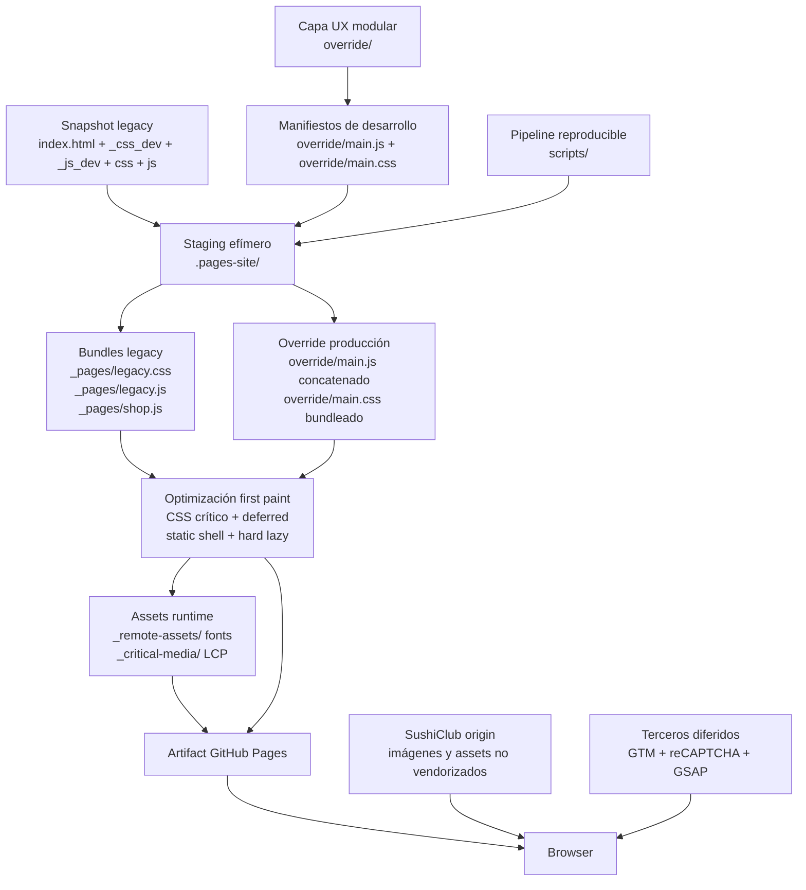
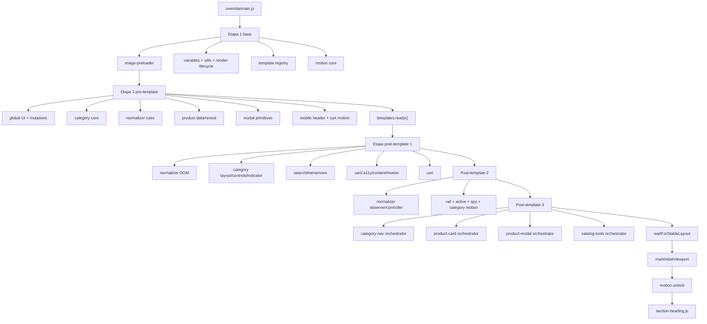
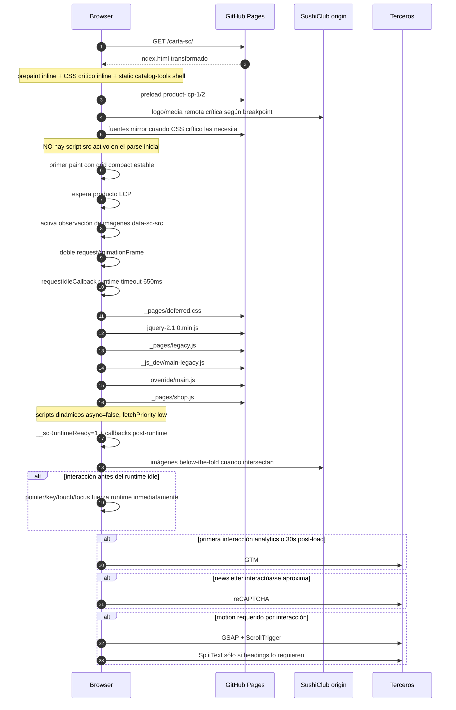

# Documentación técnica completa — carta-sc

> **Documento maestro del proyecto.** Esta es la fuente de verdad transversal para entender qué es este repositorio, qué se cambió respecto de la captura/base original, qué vive dentro y fuera de `override/`, cómo funciona el runtime, cómo se transforma la snapshot, qué se elimina o difiere durante build, cómo se entrega GitHub Pages y cómo reproducir el artifact.
>
> Para documentación localizada únicamente en la capa de override sigue existiendo `override/README.md`. Si existe una contradicción entre una descripción histórica y el código actual, **el código y los validadores del commit documentado prevalecen**.

---

## 0. Control del documento

| Campo | Valor |
|---|---|
| Repositorio | `krestosa/carta-sc` |
| Rama funcional documentada | `ux` |
| Baseline técnico previo a agregar este documento | `eb3674e4e344a4070883909b3f2d9de49cb37ea3` |
| Rama base de referencia | `main` (`7e3d30a15e84f355b8406b8fd3f5dc682b229f2a` al redactar este documento) |
| Distancia observada `main → ux` | `ux` estaba 550 commits por delante y 0 por detrás al realizar la auditoría documental |
| Snapshot de origen declarada por `index.html` | `https://www.sushiclub.com.ar/carta_delivery.php` |
| Fecha de la snapshot declarada | `2026-08-13T01:51:45.230Z` |
| Deploy | `https://krestosa.github.io/carta-sc/` |
| Workflow canónico | `.github/workflows/deploy-pages-latest.yml` |
| Último deploy funcional previo a esta documentación | run `#379`, SHA `eb3674e4...`, success |
| Artifact previo a esta documentación | ID `9274298016`, SHA-256 `f4568e682f4c6ec289b26f0a47fa968bc0f2383f1d5cf0ad8dbc1d539326ba0a` |
| Naturaleza del proyecto | Snapshot estática de una carta legacy + capa UX modular + pipeline de compilación/optimización para GitHub Pages |

### Cómo mantener este documento

Cada cambio técnico que modifique arquitectura, UX, runtime, build, dependencias, asset policy, carga, validaciones o comportamiento del artifact debe actualizar este archivo en el mismo cambio o inmediatamente después. Como mínimo se debe actualizar:

1. la sección del archivo afectado;
2. el flujo de build si cambia una transformación;
3. el flujo de carga si cambia el critical path;
4. las invariantes/validadores si se agrega o elimina una restricción;
5. la sección de UI/UX si cambia comportamiento visible;
6. la sección de decisiones históricas si se adopta o revierte una arquitectura relevante.

No usar este documento como changelog de líneas irrelevantes. El objetivo es registrar **el estado técnico efectivo y por qué existe**, con historia suficiente para no repetir decisiones que ya fallaron.

---

# 1. Qué es realmente este repositorio

Este proyecto **no es la aplicación PHP original de SushiClub** y tampoco es una SPA reconstruida desde cero. Es una arquitectura híbrida compuesta por cuatro capas:

1. **Snapshot legacy:** `index.html`, CSS y JavaScript capturados de la carta real. Conserva el DOM, contenido, selectores y comportamiento de compatibilidad que sirven como frontera legacy.
2. **Capa `override/`:** implementación modular de UI/UX, normalización, accesibilidad, navegación, tarjetas, modal, búsqueda, vistas, tema, animaciones y correcciones de integración.
3. **Pipeline de build:** scripts en `scripts/` que copian la fuente a `.pages-site/` y transforman exclusivamente la copia de staging para producir una versión optimizada y estática.
4. **Artifact de GitHub Pages:** resultado final que ya no tiene la misma topología de requests que la fuente: bundles, CSS crítico inline, CSS deferred, templates compilados, assets reescritos, fuentes mirror y dos imágenes LCP locales.

La regla conceptual principal es:

> **Fuente, staging y artifact no son la misma cosa.** Muchos archivos existen para desarrollo/compatibilidad pero no se solicitan de forma independiente en producción. Muchas modificaciones agresivas de performance se hacen sobre `.pages-site/` y nunca reescriben la snapshot fuente.

---

# 2. Arquitectura general



---

# 3. Árbol lógico del repositorio

```text
.
├── .github/
│   └── workflows/
│       └── deploy-pages-latest.yml
├── .nojekyll
├── index.html
├── _css_dev/                  # CSS legacy preservado como fuente
├── _js_dev/                   # JS legacy + bootstrap de desarrollo
├── css/                       # CSS específico shop legacy
├── js/                        # JS específico shop + jQuery/bootstrap
├── override/                  # Capa UX / comportamiento nuevo
└── scripts/                   # Compilador y optimizador de Pages
```

Directorios importantes que **NO son fuente versionada**, sino output de build:

```text
.pages-site/                   # staging completo, se recrea en cada workflow
.pages-site/_pages/            # bundles + deferred.css
.pages-site/_remote-assets/    # fuentes modernas mirror en CI
.pages-site/_critical-media/   # primeras imágenes de producto para LCP
```

---

# 4. Diferencia entre fuente, staging y artifact

## 4.1 Fuente Git

La fuente mantiene:

- la snapshot estática original;
- bibliotecas legacy que siguen siendo frontera de compatibilidad;
- un loader de desarrollo;
- módulos pequeños y editables en `override/`;
- templates HTML editables;
- CSS separado por responsabilidad;
- scripts de build y validadores.

## 4.2 Staging `.pages-site/`

El workflow hace un `rsync` del repo completo y después modifica **esa copia**. Allí se permiten acciones que no son apropiadas en source:

- concatenar JavaScript;
- concatenar CSS;
- compilar templates HTML dentro de JS;
- eliminar scripts legacy innecesarios;
- limpiar estados capturados por la snapshot;
- reescribir URLs;
- descargar assets críticos;
- insertar CSS inline;
- cambiar prioridades de red;
- retirar runtime del parse inicial.

## 4.3 Artifact final

El artifact contiene más archivos que los que efectivamente solicita el navegador porque parte del árbol fuente se copia a staging. La **topología activa** del browser es mucho más reducida.

Archivos generados relevantes:

```text
_pages/legacy.css
_pages/legacy.js
_pages/shop.js
_pages/deferred.css
override/main.css        # bundle de los 37 CSS override
override/main.js         # concatenación de todos los módulos JS override
_remote-assets/fonts/*
_remote-assets/fuentes/*
_critical-media/product-lcp-1.*
_critical-media/product-lcp-2.*
index.html               # transformado, no igual al index fuente
```

---

# 5. Cambios estructurales FUERA de `override/`

## 5.1 `index.html`

### Rol

Es la snapshot de `carta_delivery.php` y funciona como **input legacy**. Contiene el contenido de productos, categorías, footer, newsletter, menús y referencias a CSS/JS de la web original.

### Política

No se usa como lugar principal para implementar UX nueva. El build modifica la copia en `.pages-site/index.html`.

### Transformaciones de build sobre su copia

- se estampa el SHA de build;
- se reparan IDs/semántica;
- se eliminan estados runtime capturados;
- se eliminan backgrounds inline de `imgLiquid`;
- se eliminan duplicados de jQuery/GTM/reCAPTCHA;
- se remueven Google Maps si no existe flujo de mapas;
- se añade static shell de herramientas;
- se agregan preloads de media crítica;
- se convierte la política de imágenes a eager/lazy/hard-lazy;
- se elimina el loader de desarrollo del parse final;
- se insertan prepaint y delivery loader inline;
- se deja el documento inicial sin `<script src>` activo tras `optimize-pages-first-paint.py`.

## 5.2 `.nojekyll`

Evita que GitHub Pages procese el árbol como un sitio Jekyll. El artifact debe servirse como archivos estáticos directos.

## 5.3 `_js_dev/main.js`

### Antes conceptualmente

Era parte del runtime principal legacy.

### Estado actual

Es un **bootstrap/loader de desarrollo**. Separa el runtime legacy en `_js_dev/main-legacy.js` y carga la capa `override`.

Responsabilidades fuente:

- clase de prepaint/no-loading;
- restauración temprana del tema;
- restauración/migración de preferencia de vista;
- versionado `unversioned` en source;
- carga secuencial de `main-legacy`, `override/main.css` y `override/main.js`.

### Producción

`flatten-pages-bootstrap.py` elimina este request del HTML final y materializa su efecto directamente. Por eso los módulos de producción **no pueden depender de `document.currentScript` ni de IDs del loader**.

### Nota de divergencia controlada

El bootstrap fuente conserva compatibilidad legacy y puede comenzar con `normal`; la cadena de producción y `override/main.js` fuerzan el default moderno a `compact`. El artifact Pages valida explícitamente que el prepaint default sea `compact`.

## 5.4 `_js_dev/main-legacy.js`

Archivo agregado para separar el código legacy de la responsabilidad de bootstrap. Contiene comportamiento del host original que aún se necesita: navegación, sliders, fancybox/nyro, slicknav, cycle, imgLiquid legacy, dropdowns, etc.

En build no se ejecuta durante el parse inicial: forma parte del runtime tardío cargado por `sc-pages-delivery-loader`.

## 5.5 `_css_dev/`

Fuentes CSS legacy preservadas:

| Archivo | Función | Tratamiento de build |
|---|---|---|
| `font-awesome.min.css` | iconografía Font Awesome legacy | bundle; `@font-face` normalizado a WOFF2 útil |
| `bootstrap.min.css` | grid/utilidades Bootstrap legacy | bundle; parte crítica |
| `fnt-helvlig.css` | tipografía legacy | bundle; parte crítica |
| `fontBar.css` | barra/header legacy | bundle; parte crítica |
| `jquery.fancybox.css` | fancybox | bundle; normalmente deferred en first paint |
| `jquery.fancybox-buttons.css` | controles Fancybox | bundle/deferred |
| `slick.css` | Slick | bundle/deferred |
| `slick-theme.css` | theme Slick | se elimina `@font-face` Slick ausente y se usa fallback Arial |
| `sweetalert2.min.css` | SweetAlert2 | bundle/deferred |
| `slicknav__q_dd9216b6.css` | menú responsive legacy | bundle; parte crítica |
| `nyroModal_wkTheme.css` | modal legacy | bundle/deferred |
| `daterangepicker.css` | date range picker | puede podarse si el flujo de fechas no existe |
| `styles.css` | CSS global legacy | bundle; parte crítica |
| `styles_newver17.css` | revisión legacy de layout | bundle; parte crítica |

## 5.6 `css/`

| Archivo | Función | Build |
|---|---|---|
| `styles_shop__q_a48cd660.css` | estilos específicos de la carta/shop | bundle legacy; crítico |
| `_aux__q_a48cd660.css` | ajustes auxiliares de la carta | bundle legacy; crítico |

## 5.7 `_js_dev/` legacy

| Archivo | Función | Build |
|---|---|---|
| `modernizr-2.6.1-respond-1.1.0.min.js` | feature detection/compatibilidad | `_pages/legacy.js` |
| `jquery.easing.1.3.min.js` | easing jQuery | `_pages/legacy.js` |
| `jquery.cycle2.min.js` | Cycle2 | `_pages/legacy.js` |
| `jquery.slicknav.js` | navegación mobile | `_pages/legacy.js` |
| `jquery.nyroModal.custom.js` | modal legacy | `_pages/legacy.js` |
| `jquery.livequery.min.js` | livequery legacy | `_pages/legacy.js` |
| `jquery.fancybox.js` | Fancybox | `_pages/legacy.js` |
| `jquery.fancybox-buttons.js` | botones Fancybox | `_pages/legacy.js` |
| `jquery.fancybox-media.js` | media Fancybox | `_pages/legacy.js` |
| `moment.min.js` | fechas | bundle y posible pruning si no hay date flow |
| `daterangepicker.js` | selector de fechas | bundle y posible pruning |
| `imgLiquid.js` | sistema histórico de imágenes | bundle fuente; su trabajo de catálogo se poda en artifact |
| `slick.min.js` | carruseles | `_pages/legacy.js` |
| `sweetalert2.min.js` | alerts | `_pages/legacy.js` |
| `plugins.js` | plugins legacy | `_pages/legacy.js` |
| `mapKrc.js` | helpers Google Maps | se elimina del HTML de Pages si no hay consumidores |
| `main.js` | bootstrap de desarrollo | eliminado del request graph final |
| `main-legacy.js` | comportamiento host separado | runtime final tardío |

## 5.8 `js/`

| Archivo | Función | Build |
|---|---|---|
| `jquery-2.1.0.min.js` | dependencia base legacy | se conserva; runtime tardío |
| `bootstrap.min.js` | JS Bootstrap legacy | `_pages/legacy.js` |
| `funcionesShop__q_f352afe3.js` | funciones del shop | `_pages/shop.js` |
| `main_shop__q_a48cd660.js` | inicialización/behavior del shop | `_pages/shop.js`; startup parchado en first-paint |
| `main_shop_maps__q_9fc895e1.js` | integración de mapas del shop | eliminado de Pages si se demuestra que no hay map flow |

## 5.9 Archivos/árboles retirados del source

El cambio no fue “borrar algunas imágenes”, sino adoptar una política **code-only**.

Se retiraron del repositorio binarios bajo árboles como:

```text
favicon.ico
fonts/**
fuentes/**
gfx/**
iconos/**
uploads/**
uploads_shop/**
```

También se retiraron elementos auxiliares que no pertenecen al producto/runtime actual, incluyendo en el delta histórico archivos como:

```text
ABRIR_LOCAL.ps1
fallidos.json
manifest.json
motion/motion.js
motion/motion.css
```

Los antiguos `motion/*` de raíz fueron reemplazados por el sistema modular `override/motion/`.

La lista raw de cada binario histórico permanece disponible en el diff/Git history. La **unidad arquitectónica** del cambio es la política: ningún binario estático de las extensiones prohibidas debe versionarse en source.

---

# 6. Política de assets

## 6.1 Regla code-only

`scripts/externalize-pages-static-assets.py` aborta si encuentra en el repositorio archivos como:

- PNG/JPG/GIF/WebP/SVG/ICO/BMP/AVIF;
- WOFF/WOFF2/TTF/OTF/EOT;
- video;
- PDF.

## 6.2 Imágenes y recursos generales

Referencias locales de:

- `uploads_shop/`;
- `uploads/`;
- `gfx/`;
- `iconos/`;
- `fonts/`;
- `fuentes/`;
- `favicon.ico`

se reescriben hacia `https://www.sushiclub.com.ar/` y se normalizan nombres contaminados por la snapshot (`__q_<hash>`, sufijos duplicados, etc.).

## 6.3 Fuentes

Las fuentes no se consumen cross-origin directamente porque el host original no garantiza el CORS necesario para webfonts desde GitHub Pages. El build descarga formatos modernos y los escribe sólo en el artifact:

```text
_remote-assets/fuentes/AcuminPro-Regular.woff2
_remote-assets/fuentes/AcuminPro-Semibold.woff2
_remote-assets/fonts/fontawesome-webfont.woff2
_remote-assets/fonts/glyphicons-halflings-regular.woff
_remote-assets/fonts/hnl.woff
_remote-assets/fonts/bariol_bold-webfont.woff
_remote-assets/fonts/bariol_light-webfont.woff
_remote-assets/fonts/bariol_regular-webfont.woff
_remote-assets/fonts/websymbolsligaregular.woff
_remote-assets/fonts/PlutoBold.otf
```

Si falta una fuente considerada crítica, el build falla. Algunos fallbacks históricos opcionales pueden dar 404 upstream sin invalidar la entrega.

## 6.4 Media LCP

`optimize-pages-first-paint.py` descarga las dos primeras imágenes de producto de la primera fila compact mobile a:

```text
_critical-media/product-lcp-1.<ext>
_critical-media/product-lcp-2.<ext>
```

Esto evita que la primera fila dependa de una conexión tardía al origen remoto.

---

# 7. Capa `override/`: contrato general

`override/` es la capa donde reside el producto nuevo. Su diseño persigue:

- localidad de cambios;
- módulos pequeños con ownership claro;
- `init/destroy` explícitos cuando hay listeners/observers;
- boot guards únicos;
- templates HTML como fuente de markup fijo;
- JS sin dependencia de la topología del loader de desarrollo;
- CSS hoja por responsabilidad con manifest plano;
- compatibilidad con el DOM legacy como frontera externa;
- accesibilidad y reduced motion como comportamiento de primera clase.

No existe framework React/Vue/Next. La capa trabaja sobre DOM existente con JavaScript clásico, APIs del navegador, jQuery sólo donde la integración legacy lo exige y GSAP cargado de forma lazy.

---

# 8. Entrypoints de `override/`

## `override/main.js`

Es el manifiesto/loader de desarrollo y la descripción canónica del orden de módulos.

Responsabilidades adicionales:

- guard `__scOverrideMainBooted`;
- versión desde `window.__scCatalogAssetVersion`;
- guard de keepalive estático;
- bootstrap de vista `compact|normal|list`;
- migración de claves legacy de vista;
- default moderno `compact`;
- carga por etapas de módulos;
- espera del registry de templates;
- espera de layout estable;
- marcado del viewport inicial;
- unlock de motion;
- carga final de `section-heading.js`.

En Pages el loader se **elimina** y los módulos listados se concatenan en ese mismo orden.

## `override/main.css`

Manifest plano de 37 hojas CSS. Es editable en desarrollo y se concatena en Pages. No puede contener contenido distinto de `@import`; no se permiten imports anidados ni CSS huérfano.

---

# 9. Orden de módulos `override` en desarrollo



---

# 10. Inventario completo de `override/`

## 10.1 `override/core/`

| Archivo | Responsabilidad |
|---|---|
| `variables.js` | Configuración compartida: media queries, selectors, clases, easings y URLs pinneadas de GSAP 3.15.0/ScrollTrigger/SplitText. |
| `utils.js` | Helpers DOM mínimos: texto, ready, iteración, matches, visibilidad y refresh de motion. |
| `render-lifecycle.js` | Coordina DOM ready, layout estable, fonts/media, header mobile, marcación de elementos del viewport inicial y freeze de ese conjunto. |
| `variables.css` | Design tokens/variables compartidas: geometría, espacios, bordes, colores y dimensiones utilizadas por los componentes. |
| `theme.css` | Paleta y resolución visual para `data-sc-theme` / `data-sc-theme-resolved`. |
| `a11y.css` | Utilidades y estados de accesibilidad/foco, incluyendo contenido sólo para lectores de pantalla. |
| `prepaint.css` | Reserva la geometría final antes de hidratación: header, banner, rail, tools y grid. Mantiene high-density como primera geometría y evita CLS. |
| `performance.css` | Reglas del critical path mobile: mantiene el logo LCP visible y desactiva sweeps/animaciones no composited durante prepaint. |
| `no-loading-state.css` | Elimina/neutraliza estados visuales de carga legacy que no deben bloquear el contenido real. |

### Invariante crítica

El prepaint **no debe esconder el LCP**. Su función es fijar geometría, no mostrar skeletons opacos.

---

## 10.2 `override/templates/`

| Archivo | Responsabilidad |
|---|---|
| `registry.js` | Registry de templates. En desarrollo los fetch-ea; en producción recibe un payload compilado por `compile-pages-templates.py`. Provee `ready()`, `has()` y `clone()`. |

El registry exige un único elemento raíz por template y rechaza duplicados.

---

## 10.3 `override/motion/`

| Archivo | Responsabilidad |
|---|---|
| `main.js` | Motion core. Carga GSAP/ScrollTrigger bajo demanda, expone `whenReady/run/refresh/reduced/morphIcon`, coordina refresh y respeta reduced motion. |
| `global-ui.js` | Animaciones globales compartidas de superficies/controles que no pertenecen a un único componente. |
| `main.css` | Estados/transiciones CSS globales de motion. |

### Política actual de carga GSAP

Desde `eb3674e...`, GSAP **no se solicita por un evento `scroll` sintético**. Los triggers de dependencia son:

- `pointerdown`;
- `touchstart`;
- `wheel`;
- `keydown` útil;
- fallback de 30 segundos.

La petición se agenda en idle. Esto evita que restauraciones/correcciones de scroll durante carga metan GSAP en el critical path.

Los morphs simples de íconos se implementan con Web Animations/API nativa; no requieren MorphSVG.

---

## 10.4 `override/mutations/`

| Archivo | Responsabilidad |
|---|---|
| `dom-normalization.js` | Repara DOM legacy: IDs de anchors, elimina búsqueda legacy duplicada, limpia backgrounds de producto, agrega nombres accesibles, lang `es-AR`, main landmark y `rel` seguro en redes. |
| `history.js` | Restaura `history.replaceState` nativo si legacy lo parcheó y limpia hashes de categoría `#anchor...` sin interferir con history nativo. |
| `legacy-category-hover.js` | Cierra dropdowns legacy y elimina handlers hover incompatibles con la navegación de categorías nueva. |

No debe reintroducirse `override/mutations/scroll-restoration.js`; el validador lo prohíbe.

---

## 10.5 `override/features/catalog/`

| Archivo | Responsabilidad |
|---|---|
| `catalog.css` | Reglas de integración base del catálogo nuevo sobre DOM legacy. |
| `layout.css` | Geometría del catálogo, grids y layouts asociados a los modos de vista. |

---

## 10.6 `override/features/image-preloader/`

| Archivo | Responsabilidad |
|---|---|
| `image-preloader.js` | Prioridades de imágenes, observer de stages, carga inicial batcheada, protección de keepalive en Pages, preload/decoración de logo mobile y estados ready/loading. |
| `image-preloader.css` | Aspecto y reserva del stage de imagen; evita que el raster cambie la geometría de tarjeta. |

### Detalles de rendimiento

- escanea sincrónicamente sólo 8 stages;
- procesa el resto en batches de 8;
- presupuesto aproximado 4 ms;
- `requestIdleCallback` con timeout;
- IntersectionObserver `rootMargin: 120px`;
- no convierte imágenes lazy arbitrariamente a eager;
- límites eager según breakpoint/vista;
- `destroy()` cancela idle/timers/observers/listeners.

### Keepalive estático

En `krestosa.github.io`, intercepta el AJAX legacy a `carta_delivery.php` con `keepalive=1` y devuelve un Deferred resuelto. En el host real de SushiClub la petición original no se desactiva.

---

## 10.7 `override/features/content-normalizer/`

| Archivo | Responsabilidad |
|---|---|
| `rules.js` | Reglas puras de casing/editorial español. Protege `AQA` y `SushiClub`, maneja conectores y puntos decimales. |
| `dom.js` | Aplica reglas a títulos de sección, subtítulos, títulos y descripciones; limpia `b/strong` y estilos tipográficos inline heredados. |
| `observer.js` | MutationObserver focalizado. Mapea la mutation al host relevante y sólo hace deep collection en nodos agregados. |
| `content-normalizer.js` | Controller: normaliza un bloque crítico inicial y reparte el resto en idle batches antes de activar el observer. |
| `content-normalizer.css` | Estilos asociados a la normalización visual/editorial. |

### Optimización clave

La versión anterior podía deep-scanear grandes contenedores ante mutations. La actual sólo renormaliza los hosts afectados y agrupa escrituras por RAF/idle, reduciendo forced layout/main-thread work.

---

# 11. Componentes `override/components/`

## 11.1 `catalog-tools/`

| Archivo | Responsabilidad |
|---|---|
| `catalog-tools.html` | Template de search, tema, view toggle, live status y contenedor de resultados. |
| `catalog-tools.js` | Montaje/reparación del bloque, integra search/theme/view y guarda/restaura sesión de scroll/categoría. |
| `search.js` | Índice de búsqueda y filtros, ranking, reordenado, session state y restauración. El índice se construye sólo al usar búsqueda/filtro. |
| `theme.js` | Temas `system/light/dark`, persistencia, menú accesible y animaciones nativas de iconografía/transición. |
| `view.js` | Modos `compact/normal/list`, persistencia, número de columnas por breakpoint, morph del ícono y conservación de viewport al cambiar layout. |
| `catalog-tools.css` | Layout y estilo del shell de herramientas. |
| `theme.css` | Apariencia del selector de tema y estados visuales. |
| `search-state.css` | Estados de búsqueda/resultados/empty. |
| `view-stability.css` | Reglas para que el cambio de vista no produzca flashes o saltos de geometría. |

### Vistas

| Modo | Phone | Tablet | Desktop |
|---|---:|---:|---:|
| `compact` | 2 columnas | 3 columnas | 4 columnas |
| `normal` | 1 columna | 2 columnas | 3 columnas |
| `list` | 1 layout lista | 1 layout lista | 1 layout lista |

Default: **`compact`**.

La secuencia del botón es:

```text
compact → normal → list → compact
```

La preferencia unificada vive en `localStorage['scCatalogView:v3']`. Hay migración de claves antiguas por contexto.

### Búsqueda/filtros

- normalización minúsculas/diacríticos;
- matching de título/descripción;
- ranking exacto → prefix → substring → tokens;
- filtros bitmask para Poco Picante, Picante, Muy Picante y Vegetariano;
- los filtros de descuento legacy no forman parte del set moderno y se eliminan del strip;
- al buscar/filtrar se garantiza modo lista para legibilidad y reordenado;
- se preserva el orden original para restauración;
- el índice de 141 productos no se construye en startup: `ensureCaptured()` lo genera en el primer uso real.

---

## 11.2 `category-nav/`

| Archivo | Responsabilidad |
|---|---|
| `category-nav.html` | Templates de toolbar, flechas e indicador. |
| `core.js` | Resolución de anchors, offset sticky, scroll programático, duración/easing, interrupción por usuario y manejo de click/select. |
| `layout.js` | Construcción/normalización de la estructura de rail a partir de la navegación legacy. |
| `rail-controls.js` | Flechas/controles de overflow y estado de los extremos. |
| `rail-position.js` | Centrado/reveal del ítem activo dentro del scroller. |
| `sticky-state.js` | Estado sticky y clases asociadas. |
| `rail.js` | Estado del rail/overflow/sticky. Desde `f40df0a...` usa posiciones cacheadas y no mide rects en cada frame de scroll. |
| `active-state.js` | Fuente canónica del target activo y sincronización de semántica/estados. |
| `scroll-spy.js` | Detecta sección activa durante scroll; usa offset cacheado y evita invalidación geométrica por frame. |
| `indicator.js` | Línea activa con física/momentum: springs, velocidad filtrada, warp según dirección y velocidad del rail. |
| `motion.js` | Integración de motion del rail/categorías. |
| `category-nav.js` | Orquestador: listeners, submenús, MutationObserver estructural, breakpoints, refresh y teardown. |
| `desktop.css` | Layout/rail desktop. |
| `mobile.css` | Rail mobile horizontal. |
| `controls.css` | Flechas y controles. |
| `compatibility.css` | Aislamiento de estilos legacy incompatibles. |
| `motion.css` | Indicador/estados animados. |

### Indicador de momentum

`indicator.js` no mueve una línea con una transición CSS simple. Mantiene bordes izquierdo/derecho con spring crítico, filtra velocidad y agrega un `warp` asimétrico según:

- distancia restante;
- velocidad de movimiento del indicador;
- velocidad horizontal del rail;
- dirección;
- ancho del target.

Cuando el movimiento se estabiliza, hace snap exacto a píxel físico para evitar blur.

### Forced reflow corregido

`rail.js` antes medía geometría con `getBoundingClientRect()` durante scroll. El diseño actual cachea `desktopTop/mobileTop` y durante scroll compara `scrollY`; recalcula posiciones únicamente cuando layout/resize/estructura marcan `stickyDirty`.

`scroll-spy.js` tampoco invalida el offset en cada frame.

### Subcategorías

El orquestador materializa un menú accesible a partir de la estructura legacy, con hover/focus, pin en compact, Escape, outside pointer y posicionamiento respecto del rail.

---

## 11.3 `product-card/`

| Archivo | Responsabilidad |
|---|---|
| `product-card.html` | Templates de metadata accesible y grupos de traits. |
| `data.js` | Helpers de datos: imágenes, prices, labels y SVG de traits. |
| `a11y.js` | IDs/accessible name, descripción, precio actual/anterior, traits, heading levels y `aria-haspopup=dialog`. |
| `content.js` | Mueve/duplica traits al price row, normaliza labels, strip de referencias y medición batcheada de descripciones truncadas. |
| `product-card.js` | Orquestador incremental de enhancement, MutationObserver, ResizeObserver y repair. |
| `motion.js` | Integración general de motion de tarjetas. |
| `reveal-motion.js` | Reveal de tarjetas below-the-fold. Las tarjetas visibles inicialmente ya no se ocultan/revelan. |
| `image-ratio.css` | Aspect-ratio estable del medio. |
| `layout.css` | Grid interno de tarjeta y comportamiento según vista/breakpoint. |
| `content.css` | Tipografía, traits, descripción y referencias; incluye correcciones de contraste. |
| `pricing.css` | Composición visual de precio actual/anterior/oferta/traits. |
| `motion.css` | Estados animados de tarjeta. |

### Cambios funcionales importantes

- traits normalizados: Poco Picante, Picante, Muy Picante, Vegetariano;
- traits visibles asociados al área de precio para reducir altura desperdiciada;
- metadata accesible incluye precio/previous price/traits, evitando nombres indistinguibles de productos homónimos;
- descriptions se miden en lectura batcheada y las clases se escriben por separado;
- enhancement inicial: sólo 4 cards críticos en mobile/8 desktop síncronos; el resto incremental;
- observers sólo reparan cards que realmente necesitan enhancement.

### LCP/reveal

Antes de `1488c3e...`, la lógica podía hacer:

```text
producto ya visible → GSAP autoAlpha 0 → doble RAF → reveal → producto visible otra vez
```

Eso convertía un recurso ya descargado en un LCP tardío. El estado actual hace `showNow()` para cards iniciales y reserva `autoAlpha: 0 + ScrollTrigger` únicamente para `deferred` below-the-fold.

---

## 11.4 `product-modal/`

| Archivo | Responsabilidad |
|---|---|
| `product-modal.html` | Estructura fija del dialog. |
| `view.js` | Construye contenido desde una card: imagen, título, descripción, price row, traits y CTA. |
| `a11y.js` | Focusable list, focus trap, background inert/aria-hidden y contención de foco. |
| `motion.js` | Animación de apertura/cierre. |
| `product-modal.js` | Orquestador de eventos, lifecycle, hash deep-link y restore focus. |
| `shell.css` | Overlay/dialog base. |
| `content.css` | Contenido textual/media. |
| `controls.css` | Close/CTA y controles. |
| `responsive.css` | Breakpoints del modal. |
| `theme.css` | Light/dark tokens del modal. |
| `motion.css` | Estados de transición. |

### Deep linking

Un producto puede representarse con:

```text
#producto-<slug>
```

Si hay títulos duplicados se agrega sufijo ordinal. Abrir/cerrar actualiza `history.replaceState` sin generar una pila de history artificial.

### Accesibilidad

- `aria-labelledby` al título;
- close recibe foco al abrir;
- Escape cierra;
- Tab queda atrapado dentro;
- background usa `inert` si existe o `aria-hidden` fallback;
- al cerrar se restaura foco al origen cuando corresponde.

---

## 11.5 `mobile-header/`

| Archivo | Responsabilidad |
|---|---|
| `mobile-header.js` | Encuentra el SlickNav canónico, elimina duplicados capturados, instala fallback si plugin no está disponible, sincroniza ARIA y morph menú/cerrar. |
| `mobile-header.css` | Geometría/layout del header mobile corregido. |
| `morph.css` | Estados visuales del ícono morph. |

El repair usa varios delays (`0/60/120/240 ms`) para convivir con la inicialización legacy sin dejar múltiples `.slicknav_menu` en flow.

---

## 11.6 `section-heading/`

| Archivo | Responsabilidad |
|---|---|
| `section-heading.js` | Líneas/reglas y reveal de headings. SplitText se descarga sólo cuando motion está listo. |
| `layout.css` | Geometría estable de títulos/subtítulos. |
| `section-heading.css` | Estilo de reglas/títulos. |
| `responsive.css` | Ajustes por breakpoint. |

Headings del viewport inicial no reciben reveal tardío. Los below-the-fold pueden usar SplitText + ScrollTrigger; reduced motion evita la animación.

---

## 11.7 `cart/`

| Archivo | Responsabilidad |
|---|---|
| `cart.js` | Orquestador GSAP por breakpoint/reduced motion. |
| `list-motion.js` | Transiciones de items/lista del carrito. |
| `scroll-motion.js` | Reacción al scroll con perfil por dispositivo. |
| `badge-motion.js` | Motion de badges/contadores. |
| `cart.css` | Estilos del carrito ajustados por override. |

Los perfiles de motion varían en mobile/tablet/desktop para limitar lag/velocity.

---

# 12. Templates compilables

Los únicos templates permitidos son exactamente:

```text
product-modal
category-toolbar
category-arrow-left
category-arrow-right
category-indicator
product-card-a11y-meta
product-trait-group
catalog-tools
```

Fuentes:

```text
override/components/product-modal/product-modal.html
override/components/category-nav/category-nav.html
override/components/product-card/product-card.html
override/components/catalog-tools/catalog-tools.html
```

En desarrollo el registry los obtiene por fetch. En Pages, `compile-pages-templates.py` reemplaza el marker:

```js
var COMPILED_TEMPLATES=null;/*__SC_TEMPLATE_PAYLOAD__*/
```

por un objeto serializado. Así el browser de producción no necesita cuatro requests HTML extra.

---

# 13. CSS override: los 37 owners y su lugar en first paint

El orden del manifest es contractual:

| # | Archivo | Ownership | First-paint actual |
|---:|---|---|---|
| 1 | `core/variables.css` | tokens | crítico |
| 2 | `core/theme.css` | theme base | crítico |
| 3 | `core/a11y.css` | accesibilidad | crítico |
| 4 | `features/catalog/catalog.css` | integración catálogo | crítico |
| 5 | `components/category-nav/desktop.css` | nav desktop | crítico |
| 6 | `components/category-nav/mobile.css` | nav mobile | crítico |
| 7 | `components/category-nav/controls.css` | controles nav | crítico |
| 8 | `core/prepaint.css` | geometría inicial | crítico |
| 9 | `core/performance.css` | guardas LCP/animación | crítico |
| 10 | `core/no-loading-state.css` | loading legacy | crítico |
| 11 | `motion/main.css` | motion global | deferred |
| 12 | `category-nav/motion.css` | nav motion | deferred |
| 13 | `product-card/motion.css` | card motion | deferred |
| 14 | `cart/cart.css` | cart | deferred |
| 15 | `product-modal/motion.css` | modal motion | deferred |
| 16 | `product-card/image-ratio.css` | ratio imagen | crítico |
| 17 | `features/catalog/layout.css` | grid | crítico |
| 18 | `catalog-tools/catalog-tools.css` | tools | crítico |
| 19 | `catalog-tools/theme.css` | theme control | crítico |
| 20 | `section-heading/layout.css` | headings geometry | crítico |
| 21 | `product-card/layout.css` | card geometry | crítico |
| 22 | `product-card/content.css` | card content | crítico |
| 23 | `product-card/pricing.css` | precios | crítico |
| 24 | `section-heading/section-heading.css` | heading visuals | crítico |
| 25 | `content-normalizer/content-normalizer.css` | normalizer visual | deferred |
| 26 | `section-heading/responsive.css` | heading responsive | crítico |
| 27 | `mobile-header/mobile-header.css` | header mobile | crítico |
| 28 | `mobile-header/morph.css` | icon header | crítico |
| 29 | `category-nav/compatibility.css` | neutralización legacy | crítico |
| 30 | `product-modal/shell.css` | modal shell | deferred |
| 31 | `product-modal/content.css` | modal content | deferred |
| 32 | `product-modal/controls.css` | modal controls | deferred |
| 33 | `product-modal/responsive.css` | modal responsive | deferred |
| 34 | `product-modal/theme.css` | modal theme | deferred |
| 35 | `catalog-tools/search-state.css` | search states | deferred |
| 36 | `catalog-tools/view-stability.css` | view switch stability | crítico |
| 37 | `image-preloader/image-preloader.css` | image stage | crítico |

La clasificación “crítico/deferred” la define `OVERRIDE_CRITICAL` en `optimize-pages-first-paint.py`; no se debe asumir por la posición del import.

---

# 14. UI/UX implementada respecto de la snapshot legacy

## 14.1 Alta densidad por defecto

La carta arranca en `compact`, no espera a JavaScript para decidir una segunda geometría. Esto es una decisión de UX y de CLS.

- phone: 2 columnas;
- tablet: 3;
- desktop: 4.

Las preferencias del usuario se aplican en prepaint y persisten.

## 14.2 Tres densidades/vistas reales

Se preservan tres estados:

- `compact` — alta densidad;
- `normal` — baja densidad;
- `list` — lista.

`normal` no debe normalizarse internamente a `compact`: son estados distintos.

## 14.3 Search/filter toolbar

Se agregó un toolbar unificado con:

- search;
- filtros de traits;
- selector de tema;
- cambio de vista;
- live region de resultados.

En Pages su **shell existe antes del runtime**, de modo que hidratarlo no cambia la altura del primer viewport.

## 14.4 Theme

Temas:

- automático/sistema;
- claro;
- oscuro.

La selección se pinta antes del runtime para evitar theme flash.

## 14.5 Categorías

Se reemplaza el comportamiento legacy fragmentado por:

- rail horizontal;
- sticky desktop/mobile;
- overflow arrows;
- scroll spy;
- active indicator con momentum;
- scroll programático suave;
- subcategorías accesibles;
- cierre/interrupción consistente.

## 14.6 Cards

Se mejoran:

- layout por densidad;
- pricing;
- traits junto a metadata/precio;
- truncado medido de descripciones;
- imagen con aspect ratio estable;
- accessible names;
- reveal sólo below-the-fold.

## 14.7 Modal de producto

Sustituye la dependencia visual del modal legacy para el flujo de inspección de producto, sin reemplazar el backend/cart real. El CTA final apunta a SushiClub.

## 14.8 Mobile header

Repara duplicación/estado de SlickNav y agrega icono menu/close accesible sin depender de MorphSVG.

## 14.9 Editorial

Se normalizan textos de la carta sin reescribir el contenido fuente manualmente: casing, conectores, marcas y estilos heredados.

---

# 15. Optimización de performance — catálogo completo de cambios

## 15.1 Critical path

- CSS local inicialmente bundleado;
- luego separado entre crítico inline y `_pages/deferred.css`;
- runtime local retirado del parse inicial;
- static toolbar shell antes de hidratación;
- prepaint con geometría final;
- producto LCP descargable desde parse;
- media below-the-fold hard-lazy.

## 15.2 Imágenes

### Fuente

`image-preloader.js`:

- primeros stages síncronos limitados;
- batches idle;
- native `loading`/`decoding`;
- prioridad baja para no críticos;
- no promoción masiva a eager.

### Artifact

`optimize-pages-first-paint.py` vuelve la estrategia aún más estricta:

1. producto #1: `src`, `loading=eager`, `decoding=async`, `fetchpriority=high`;
2. producto #2: `src`, `loading=lazy`, `fetchpriority=auto`;
3. #3..N: se quita `src` y queda `data-sc-src`, lazy, low;
4. #1 y #2 se mirror en `_critical-media/`;
5. el delivery loader activa el resto con IntersectionObserver `80px`.

## 15.3 Banner/logo

- logo mobile: preload high y dimensiones conocidas;
- banner: dimensiones intrínsecas 1500×157;
- prepaint mantiene aspect ratio;
- en first-paint el banner se prioriza sólo en desktop; mobile prioriza logo/producto.

## 15.4 CLS

Correcciones explícitas:

- eliminar `height/min-height` capturado de `.normCols`;
- misma vista `compact` antes y después de hidratación;
- reserva del rail desktop;
- static tools shell y placeholder de traits;
- dimensiones de banner/TikTok;
- aspect ratio de producto;
- headers provisionales fuera del flow.

El bug más grave detectado históricamente fue una geometría inicial `normal` que runtime convertía a `compact`, provocando un relayout 1→2 columnas mobile y un CLS masivo. La build actual valida `compact` en prepaint.

## 15.5 LCP

Se corrigieron dos causas diferentes:

1. **red:** mirror/preload de la primera imagen y logo prioritario;
2. **render:** cards del viewport inicial ya no pasan por `autoAlpha:0` al hidratar.

## 15.6 Main thread

- search inventory lazy;
- content normalizer batcheado;
- card enhancement batcheado;
- description read/write separados;
- image scan batcheado;
- rail sticky sin rect reads por scroll;
- scroll spy con offset cache;
- shop startup repartido en pequeños `setTimeout`;
- `shop_imgLiquids`, `shop_normalizeCols` y `Knormalize` eliminados del runtime final cuando el pipeline ya reproduce su resultado estáticamente.

## 15.7 Third parties

### GTM

No se elimina funcionalmente, pero se retira del critical path. Carga con la primera interacción relevante o 30 s después de `load`.

### reCAPTCHA

No carga durante primer paint. Se solicita cuando el newsletter recibe interacción o se aproxima al viewport.

### Google Maps

Se elimina del artifact **sólo si** el script demuestra que no existe markup ni uso de helpers de mapas. Si detecta un consumidor, el build aborta en vez de eliminarlo silenciosamente.

### GSAP

- versión pinneada `3.15.0`;
- se carga bajo demanda;
- ScrollTrigger luego de GSAP;
- SplitText sólo para headings cuando motion está listo;
- no forma parte del parse inicial;
- no se dispara por `scroll` sintético.

## 15.8 Source maps

Directivas `sourceMappingURL` stale se eliminan de bundles finales para no generar 404/errores de consola.

---

# 16. Qué se ELIMINA realmente y qué sólo se DIFIERE

| Elemento | Source | Artifact | Motivo |
|---|---|---|---|
| binarios de imágenes/assets | eliminados de Git | remotos o críticos mirror | repo code-only |
| fuentes modernas | no versionadas | mirror local | CORS/performance |
| Google Maps API | source la referencia | removida si no hay map flow | JS innecesario |
| `mapKrc.js` | existe | no activo si sin map flow | innecesario |
| `main_shop_maps` | existe | no activo si sin map flow | innecesario |
| fallback `document.write` de jQuery | snapshot source | eliminado | duplicado |
| jQuery 2.1.0 | existe | se conserva | compatibilidad legacy |
| GTM capturado | snapshot | eliminado | duplicado/stale |
| GTM canónico | snapshot | diferido | analytics preservado |
| reCAPTCHA runtime capturado | snapshot | eliminado | estado capturado inválido |
| reCAPTCHA API | existe | diferida | newsletter preservado |
| Moment/DateRangePicker | source | podable condicional | date flow inactivo |
| imgLiquid library | source | puede permanecer bundle | compatibilidad general |
| imgLiquid catálogo | source behavior | trabajo de catálogo podado | resultado ya estático |
| `shop_imgLiquids` | source shop | función eliminada del bundle final | trabajo redundante |
| `shop_normalizeCols` | source shop | función eliminada del bundle final | causa de layout/reflow redundante |
| `Knormalize` | legacy | eliminado del bundle final | redundante |
| `override/main.js` loader | source | loader reemplazado por bundle concatenado | menos requests/semántica estable |
| templates `.html` | source | compilados dentro registry | evitar fetchs runtime |
| CSS leaf | source | bundle/split | requests reducidos |
| reveal de cards iniciales | source histórico | eliminado del comportamiento actual | LCP |
| reveal below-the-fold | existe | existe | UX preservada |

---

# 17. Pipeline de build: orden exacto

```mermaid
flowchart TD
    A["Checkout exact GITHUB_SHA"] --> B["validate-overrides.mjs"]
    B --> C["rsync repo → .pages-site"]
    C --> D["compile-pages-templates.py"]
    D --> E["prepare-pages-artifact.py"]
    E --> F["optimize-pages-critical-path.py"]
    F --> G["clean-pages-product-images.py"]
    G --> H["clean-pages-snapshot.py"]
    H --> I["flatten-pages-bootstrap.py"]
    I --> J["bundle-pages-legacy-css.py"]
    J --> K["bundle-pages-legacy-js.py"]
    K --> L["bundle-pages-shop-js.py"]
    L --> L2["externalize-pages-static-assets.py"]
    L2 --> M["node --check bundles"]
    M --> N["validate local assets"]
    N --> O["validate HTML"]
    O --> P["validate performance budget"]
    P --> Q["optimize-pages-delivery.py"]
    Q --> R["optimize-pages-first-paint.py"]
    R --> S["node --check final"]
    S --> T["validate assets + HTML final"]
    T --> U["guards first-paint"]
    U --> V["upload-pages-artifact"]
    V --> W["stale SHA guard"]
    W --> X["deploy-pages"]
```



---

# 18. Scripts de build, archivo por archivo

| Script | Fase | Qué hace |
|---|---:|---|
| `compile-pages-templates.py` | 1 | Compila los 8 templates permitidos dentro de `templates/registry.js`. Rechaza missing/extra/duplicados. |
| `prepare-pages-artifact.py` | 2 | Estampa SHA, hints iniciales, lazy base, elimina maps si seguro, bundlea override CSS/JS y valida manifest. |
| `optimize-pages-critical-path.py` | 3 | `display=swap` Roboto, mueve hints al comienzo del head, preload banner/fonts/runtime. |
| `clean-pages-product-images.py` | 4 | Elimina backgrounds inline imgLiquid sin corromper entidades HTML. |
| `clean-pages-snapshot.py` | 5 | Limpia runtime capturado, repara IDs/a11y/dimensiones, `.normCols`, GTM/reCAPTCHA/jQuery duplicados. |
| `flatten-pages-bootstrap.py` | 6 | Reemplaza `_js_dev/main.js` por prepaint inline + entrada directa, default compact. |
| `bundle-pages-legacy-css.py` | 7 | Une 16 CSS legacy, rebasa URLs y corrige font fallbacks. |
| `bundle-pages-legacy-js.py` | 8 | Une 16 JS legacy en orden, preserva source markers. |
| `bundle-pages-shop-js.py` | 9 | Une 2 JS de shop; poda date flow inactivo; ejecuta externalizer. |
| `externalize-pages-static-assets.py` | 9b | Enforce code-only, reescribe assets, mirror de fuentes y valida upstream crítico. |
| `validate-pages-local-assets.py` | guard | Verifica que todo recurso local activo exista y no escape del artifact. |
| `validate-pages-html.py` | guard | IDs, fragments, controls, social names, imgShop, Unicode y versión pinneada de GSAP. |
| `validate-pages-performance-budget.py` | guard intermedio | Topología esperada pre-first-paint: 5 scripts/2 CSS, lazy products, banner, preloads, cero remote blocking. |
| `optimize-pages-delivery.py` | 10 | Inline CSS, font-display, defer runtime, hard-lazy, source maps, delay GTM/reCAPTCHA, delivery loader inicial. |
| `optimize-pages-first-paint.py` | 11 | Split critical/deferred, local LCP products, static tools shell, runtime gated, poda imgLiquid/Knormalize, loader final. |
| `validate-overrides.mjs` | pre-build | Sintaxis, manifests completos, invariantes de arquitectura, templates, CSS, no orphan files, no APIs prohibidas. |

---

# 19. Bundles generados

## `_pages/legacy.css`

Combina exactamente 16 hojas legacy con comentarios `/* source: ... */` para trazabilidad.

## `_pages/legacy.js`

Combina exactamente 16 scripts legacy en orden. El bundler rechaza archivos que dependan de `document.currentScript` o `import.meta`.

## `_pages/shop.js`

Combina:

```text
js/funcionesShop__q_f352afe3.js
js/main_shop__q_a48cd660.js
```

En first-paint se parchea su startup para:

- ejecutar inmediatamente sólo copia de nav/locale segura;
- repartir jobs legacy en offsets de 18 ms;
- remover funciones de normalización de imagen/columnas ya innecesarias.

## `_pages/deferred.css`

Se crea al final del split de first paint con CSS no crítico. La implementación actual también mueve allí el bloque Roboto generado por `optimize-pages-delivery.py`.

### Deuda técnica conocida

Roboto dentro de `deferred.css` significa que la tipografía puede seguir entrando después del primer paint. Se probó un experimento para moverla al critical path, pero ese commit de build falló una guard de imágenes y **no se desplegó**; fue revertido. No reintroducir esa variante sin construirla sobre el script exacto actual y validar artifact completo.

---

# 20. Orden de carga REAL del sitio publicado

La fuente no representa el orden final. El artifact de Pages usa este flujo:



### Clicks en controles antes del runtime

El delivery loader captura clicks tempranos sobre:

- view toggle;
- theme toggle;
- theme option.

Hace `preventDefault`, fuerza `runtime()` y luego reproduce el click cuando `__scRuntimeReady` está listo. Así el usuario no pierde la interacción aunque el JS de componentes todavía no haya cargado.

---

# 21. State management sin framework

## localStorage

| Key | Uso |
|---|---|
| `scTheme:v1` | `system/light/dark` |
| `scCatalogView:v3` | `compact/normal/list` |
| claves `scCatalogView:v2:*` y antiguas | sólo migración hacia v3 |

## sessionStorage

| Key | Uso |
|---|---|
| `scCatalogSession:v1:<path+search>` | Y scroll, categoría y tiempo para sesión de catálogo |
| `scCatalogSearch:v1:<path+search>` | query de búsqueda |

No se escribe `history.scrollRestoration`. El proyecto deja esa API nativa. El componente catalog-tools sí conserva un estado propio de sesión y puede reubicar el viewport tras montaje; son responsabilidades distintas.

---

# 22. Accesibilidad

Cambios estructurales:

- `lang="es-AR"` si falta;
- main landmark sobre el contenedor;
- nombres de select/newsletter/cart/social;
- link de banner con nombre;
- alt decorativo vacío donde corresponde;
- social `_blank` con `noopener noreferrer`;
- heading levels para títulos de cards según sección;
- accessible names de cards incluyen metadata de precio/traits;
- modal real `dialog` con focus trap;
- background inert;
- Escape;
- focus restore;
- category submenu con roles/aria-expanded/controls;
- toolbar search con `aria-live`;
- theme con `menuitemradio`;
- view toggle con label contextual;
- reduced motion respetado.

El cambio de accessible name de cards es deliberado: dos productos con el mismo título/descripción pero precios distintos dejan de ser enlaces con propósito accesible indistinguible.

---

# 23. Validadores e invariantes

## `validate-overrides.mjs`

Protege, entre otras, estas reglas:

- todo JS parsea;
- no `scrollRestoration`;
- no jQuery private `._data()`;
- no `document.currentScript`;
- no `import.meta`;
- no archivo `scroll-restoration.js`;
- fixed UI markup sale de templates, no de `createElement/innerHTML` en módulos estructurales seleccionados;
- boot guards únicos;
- ningún JS override huérfano;
- ningún CSS override huérfano;
- ningún template huérfano;
- IDs del loader únicos;
- los módulos no dependen de esos IDs;
- manifest exacto de 8 templates;
- CSS imports planos `?v=unversioned`;
- bootstrap source tiene un único placeholder `unversioned`;
- `index.html` fuente no contiene templates override inyectados.

En el baseline documentado valida 47 archivos JS contando bootstrap, 4 HTML de templates y 37 imports CSS.

## `validate-pages-local-assets.py`

- resuelve src/srcset/href activos;
- rechaza recursos root-relative incompatibles con project Pages;
- rechaza escapes fuera de `.pages-site`;
- comprueba `url()` de CSS activo.

## `validate-pages-html.py`

- IDs duplicados;
- fragment links rotos;
- malformed imgShop style;
- names accesibles en controles;
- names accesibles de social;
- U+FFFD;
- GSAP sin pin de versión.

## `validate-pages-performance-budget.py`

Es un budget **intermedio**, previo al first-paint split. Espera:

```text
5 scripts locales
2 stylesheets locales
141 imágenes de producto lazy/async
preloads críticos
0 scripts remotos blocking
```

Luego `optimize-pages-first-paint.py` cambia deliberadamente esa topología y aplica sus propios guards.

---

# 24. Workflow de deploy y protecciones contra carreras

`.github/workflows/deploy-pages-latest.yml` corre en push a `ux` y `workflow_dispatch`.

Protecciones:

1. cancela builds Pages legacy que compitan;
2. intenta cancelar deployment anterior;
3. checkout **exacto** de `github.sha`;
4. verifica que `git rev-parse HEAD == GITHUB_SHA`;
5. consulta `refs/heads/ux` y aborta si el run ya quedó stale;
6. construye/valida;
7. antes de deploy vuelve a comprobar que `ux` siga apuntando al mismo SHA;
8. recién entonces publica.

Esto evita que un workflow lento de un commit viejo pise un commit nuevo.

---

# 25. Reproducción manual del build

La referencia canónica es siempre el workflow. Para reproducirlo fuera de GitHub Actions usar Linux/WSL con:

- Git;
- Python 3;
- Node.js;
- `rsync`;
- acceso de red a SushiClub y, según fase, Google Fonts.

Ejemplo equivalente:

```bash
set -euo pipefail

export GITHUB_SHA="$(git rev-parse HEAD)"

node scripts/validate-overrides.mjs

rm -rf .pages-site
mkdir -p .pages-site
rsync -a --exclude='.git' --exclude='.pages-site' ./ .pages-site/

python3 scripts/compile-pages-templates.py
python3 scripts/prepare-pages-artifact.py
python3 scripts/optimize-pages-critical-path.py
python3 scripts/clean-pages-product-images.py
python3 scripts/clean-pages-snapshot.py
python3 scripts/flatten-pages-bootstrap.py
python3 scripts/bundle-pages-legacy-css.py
python3 scripts/bundle-pages-legacy-js.py
python3 scripts/bundle-pages-shop-js.py

node --check .pages-site/override/main.js
node --check .pages-site/_pages/legacy.js
node --check .pages-site/_pages/shop.js

python3 scripts/validate-pages-local-assets.py
python3 scripts/validate-pages-html.py
python3 scripts/validate-pages-performance-budget.py

python3 scripts/optimize-pages-delivery.py
python3 scripts/optimize-pages-first-paint.py

node --check .pages-site/override/main.js
node --check .pages-site/_pages/legacy.js
node --check .pages-site/_pages/shop.js
node --check .pages-site/_js_dev/main-legacy.js

python3 scripts/validate-pages-local-assets.py
python3 scripts/validate-pages-html.py
```

Después deben repetirse los guards del workflow sobre:

- presencia de `sc-pages-critical-css`;
- presencia de `sc-pages-delivery-loader`;
- `_pages/deferred.css` no vacío;
- ausencia de stylesheet blocking de legacy/override;
- ausencia del bootstrap eager de reCAPTCHA;
- ausencia del bootstrap eager de GTM.

Para una reproducción exacta de deployment, usar el workflow, ya que GitHub Pages empaqueta y publica el artifact con metadatos de ejecución.

---

# 26. Qué significa “reproducible” en este proyecto

## Reproducible a nivel de código: SÍ

Un SHA fija:

- snapshot;
- módulos override;
- versiones de scripts;
- transformaciones;
- orden de bundle;
- validaciones.

## Reproducible estructuralmente: SÍ

Con los mismos upstream disponibles, el pipeline debe producir la misma topología y cumplir las mismas invariantes.

## Hermético/byte-for-byte: NO completamente

Hay inputs vivos:

1. fuentes descargadas desde `sushiclub.com.ar`;
2. dos imágenes de producto LCP descargadas desde SushiClub;
3. CSS de Roboto que `optimize-pages-delivery.py` intenta obtener de Google y tiene fallback si falla.

Por eso el mismo commit ejecutado meses después podría producir bytes de media/fuentes diferentes si upstream cambia.

### Para volverlo 100% hermético

Sería necesario, por ejemplo:

- manifest de asset URL + SHA-256;
- cache/artifact release inmutable por snapshot;
- rechazar upstream con hash inesperado;
- pinnear también el payload Google Fonts o vendorización autorizada;
- usar el artifact firmado/digest como fuente de entrega.

No confundir “deploy exacto del código” con “reproducción criptográficamente idéntica de recursos remotos”.

---

# 27. Performance: evolución y estado de medición

Hubo varias iteraciones de Lighthouse/PageSpeed. Los aprendizajes importantes son más valiosos que un score aislado:

- reducir TBT no sirve si se introduce CLS;
- diferir módulos estructurales puede empeorar drásticamente layout;
- el LCP puede tener red rápida pero render delay alto si motion lo oculta;
- medir geometría en scroll genera forced reflow aunque TBT general parezca bajo.

Un baseline previo a las últimas correcciones llegó a:

```text
Performance 62
FCP 1.2 s
LCP 3.8 s
TBT 40 ms
CLS 0.609
Speed Index 5.4 s
Accessibility 100
Best Practices 100
SEO 100
```

Ese reporte precedía las correcciones finales de:

- default compact/prepaint estable;
- `.normCols` sin altura capturada;
- rail geometry cache;
- no hide/reveal del viewport inicial;
- GSAP no disparado por scroll sintético.

**No documentar 100 Performance como obtenido hasta que exista un reporte que mida el SHA correspondiente.** El target del proyecto puede ser 100, pero el documento debe diferenciar objetivo de medición verificada.

---

# 28. Decisiones/reversiones históricas relevantes

## 28.1 Runtime split agresivo descartado

Se probó diferir/separar demasiado el override runtime. Aunque redujo carga inicial de JS, los módulos responsables de geometría llegaron después del paint y produjeron CLS severo. Esa arquitectura se revirtió.

**Lección:** los módulos estructurales y el CSS que define geometría deben estar representados en el primer paint, aunque la lógica interactiva se difiera.

## 28.2 Observers amplios reducidos

El content normalizer pasó de inspeccionar árboles profundos ante mutations a resolver el host más cercano y deep-scanear sólo nuevos nodos.

**Lección:** MutationObserver debe detectar invalidación, no convertirse en un crawler continuo.

## 28.3 Search indexing movido fuera de startup

El catálogo completo no se indexa hasta que existe query/filtro.

**Lección:** preparar funcionalidad no usada en el first viewport perjudica TBT sin beneficio visible.

## 28.4 Scroll spy/rail reescritos para cache de geometría

Se quitaron invalidaciones y rect reads por frame.

**Lección:** separar fase de medición de fase de scroll.

## 28.5 Reveal de primera fila eliminado

Se preserva motion below-the-fold, pero nunca se apaga contenido ya visible para luego animarlo.

**Lección:** first paint estable tiene prioridad sobre un reveal decorativo.

## 28.6 Experimento Roboto crítico fallido y NO desplegado

Se intentó cambiar la ubicación de Roboto en el split; el experimento reemplazó incorrectamente una versión de script de delivery y falló el guard “Expected product images were not optimized”. El workflow impidió deploy. Se hizo un revert posterior y producción quedó estable.

**Lección:** modificar scripts de build sobre el contenido exacto vigente; no sustituir archivos completos desde una copia parcialmente desactualizada.

## 28.7 Motion no se activa por scroll sintético

Cambio final de `eb3674e...`: se quitó `scroll` del armado de dependencias motion.

**Lección:** evento de scroll no equivale a intención del usuario durante carga.

---

# 29. Elementos que NO deben confundirse

## `override/main.js` source vs production

Source = loader/manifiesto. Producción = concatenación de módulos + tail.

## `override/main.css` source vs production

Source = 37 imports. Producción = bundle; luego parte inline critical y parte deferred.

## Templates source vs producción

Source = 4 `.html`. Producción = payload JS compilado; además `catalog-tools` se usa para inyectar static shell en `index.html`.

## Assets source vs producción

Source = cero binarios. Producción = fuentes mirror + 2 LCP images locales + URLs remotas.

## Legacy eliminado vs legacy diferido

jQuery/Bootstrap/plugins no fueron “migrados” ni eliminados por completo. Se preservan donde la compatibilidad lo necesita y se sacan del critical path.

---

# 30. Contrato para modificaciones futuras

## Si cambia UI fija

1. editar template `.html` correspondiente;
2. editar CSS owner;
3. JS sólo conecta comportamiento;
4. no crear markup fijo con `createElement/innerHTML` en módulos protegidos;
5. correr validator.

Excepción actual: algunos elementos dinámicos, como submenu de categorías, son construidos en runtime porque su contenido depende de la estructura legacy.

## Si se agrega un módulo JS

1. crear archivo bajo el owner correcto;
2. agregar literal a `override/main.js` en la etapa correcta;
3. boot guard único;
4. definir teardown si agrega listeners/observers/timers;
5. no depender del ID de `<script>`;
6. validar producción concatenada.

## Si se agrega CSS

1. owner claro;
2. import en `override/main.css` con `?v=unversioned`;
3. sin nested imports;
4. decidir si entra en `OVERRIDE_CRITICAL` o deferred;
5. validar first paint.

## Si cambia la snapshot

No asumir que los regex del build seguirán matcheando. Correr el pipeline completo. Los scripts están diseñados para fallar cuando un elemento esperado cambia de forma, en vez de producir una optimización parcialmente aplicada.

## Si cambia un asset

No agregar binario al repo. Revisar si:

- puede seguir remoto;
- necesita mirror de build;
- es crítico y debe entrar a `_critical-media`;
- requiere hash para reproducibilidad futura.

---

# 31. Checklist de entrega

Antes de considerar un cambio listo:

```text
[ ] Scope del cambio identificado
[ ] No se modificó legacy innecesariamente
[ ] Todos los módulos JS tienen boot guard único
[ ] Listeners/observers/timers tienen teardown si corresponde
[ ] No hay JS/CSS/template huérfano
[ ] Template manifest sigue exacto
[ ] CSS manifest sigue plano
[ ] node --check pasa
[ ] validate-overrides pasa
[ ] build completo de .pages-site pasa
[ ] local-assets pasa
[ ] HTML audit pasa
[ ] performance budget intermedio pasa
[ ] first-paint guards pasan
[ ] workflow desplegó exactamente el SHA actual
[ ] no hay workflow stale pisando Pages
[ ] artifact corresponde al mismo SHA
[ ] si el cambio afecta performance: PageSpeed mide ESE SHA
[ ] si cambia arquitectura/build: actualizar este documento
```

---

# 32. Troubleshooting

## La web “se ve sin estilos”

Comprobar si se está abriendo `index.html` source directamente esperando topología de Pages. La fuente conserva múltiples rutas y loader de desarrollo; el artifact usa bundles/rewrite. Para probar la entrega real usar `.pages-site` luego del pipeline o GitHub Pages.

## Aparecen 404 de assets locales

Correr `validate-pages-local-assets.py`. Verificar que `externalize-pages-static-assets.py` haya reescrito los roots y que fonts requeridas existan en `_remote-assets`.

## Aparece layout shift masivo

Prioridades de diagnóstico:

1. `data-sc-catalog-view` antes del paint;
2. `.normCols` inline height/min-height;
3. static tools shell;
4. mobile SlickNav duplicado;
5. banner dimensions/aspect ratio;
6. fonts tardías;
7. JS que modifica display/grid después del first paint.

## LCP tiene bajo load time pero alto render delay

Buscar:

- `opacity/visibility` del candidato o ancestros;
- reveals GSAP aplicados a elementos iniciales;
- CSS de prepaint que oculte contenido real;
- runtime esperando fonts/layout aunque el recurso ya esté descargado.

## Forced reflow en scroll

Buscar `getBoundingClientRect`, `getComputedStyle`, `offset*`, `scroll*` mezclados con writes dentro del mismo frame. Medir geometría en invalidación/resize y cachear para scroll.

## El workflow falla por un regex de build

No “relajar” el guard inmediatamente. Primero confirmar si la snapshot/legacy cambió y si la transformación sigue siendo válida. Los `expected exactly one` son deliberados.

---

# 33. Seguridad y límites del snapshot

- La snapshot incluye referencias/metadata heredadas de una aplicación real. No asumir que credenciales/tokens capturados son apropiados para producción.
- El proyecto estático no posee el backend PHP original.
- Keepalive se neutraliza exclusivamente en GitHub Pages.
- CTA/links que necesitan backend siguen apuntando al host de SushiClub.
- reCAPTCHA/GTM siguen siendo servicios externos y deben tratarse como dependencias separadas.
- Headers como CSP/HSTS/COOP/X-Frame-Options pertenecen al hosting y no se “arreglan” mediante `override/` si Pages no permite controlarlos.

---

# 34. Glosario del proyecto

| Término | Significado aquí |
|---|---|
| snapshot | HTML/CSS/JS capturado de una instancia real y usado como base estática |
| legacy | código original preservado como frontera de compatibilidad |
| override | capa modular propia que modifica UX/comportamiento sin reescribir toda la app |
| prepaint | estado CSS/atributos aplicado antes de hidratación para que la primera geometría sea final |
| static shell | markup de UI insertado en build para reservar geometría antes del runtime |
| hydration | conexión del runtime override a markup ya existente; no es hidratación React |
| critical CSS | subset inline necesario para primer viewport estable |
| deferred CSS | estilos que pueden llegar con runtime sin cambiar el first paint crítico |
| hard-lazy | imagen sin `src` inicial; URL guardada en `data-sc-src` hasta intersección |
| LCP mirror | copia de build de las primeras imágenes críticas bajo `_critical-media` |
| code-only | política que prohíbe assets binarios en Git source |
| staging | `.pages-site`, copia efímera transformable |
| artifact | árbol final que GitHub Pages publica |
| hermético | build que no depende de inputs de red mutables |
| boot guard | flag `__...Booted` que impide inicialización duplicada de un módulo |

---

# 35. Resumen operativo de una línea por capa

```text
index.html                    = contenido/DOM capturado
_css_dev + _js_dev + css + js = compatibilidad legacy
_js_dev/main.js               = loader de desarrollo
_js_dev/main-legacy.js        = host legacy separado
override/main.js              = manifest JS / bundle source
override/main.css             = manifest CSS
override/templates            = fixed markup editable
scripts/*                     = compilador/optimizador/validadores
.pages-site                   = staging efímero
_pages/*                      = bundles de producción
_remote-assets/*              = fonts descargadas sólo para artifact
_critical-media/*             = 2 imágenes críticas descargadas sólo para artifact
GitHub Pages                  = entrega final estática
SushiClub origin              = backend/medios no vendorizados
```

---

# 36. Regla final de ownership

Cuando haya duda sobre dónde implementar algo:

- **contenido capturado/datos del catálogo:** snapshot/host, tratar como frontera;
- **nueva UX/comportamiento de carta:** `override/`;
- **optimización que sólo debe afectar Pages:** `scripts/` sobre `.pages-site/`;
- **orden de publicación:** workflow;
- **markup fijo nuevo:** template;
- **estado visual inicial:** prepaint/CSS crítico;
- **interacción tardía/animación:** módulo owner + motion lazy;
- **asset binario:** nunca agregarlo al source sin cambiar conscientemente la política code-only.

Este reparto es parte de la arquitectura, no una convención opcional.

---

# 37. Historial documental

| Fecha | Baseline técnico | Cambio documentado |
|---|---|---|
| 2026-08-16/17 | `eb3674e4e344a4070883909b3f2d9de49cb37ea3` | Creación de documentación maestra: arquitectura, delta outside/inside override, UI/UX, performance, build, asset policy, validadores, Mermaid, reproducibilidad y decisiones históricas. |

---

## Fin del documento maestro

Si una futura modificación hace que una sección deje de describir el artifact real, **la tarea no está terminada hasta actualizar esta documentación**.
