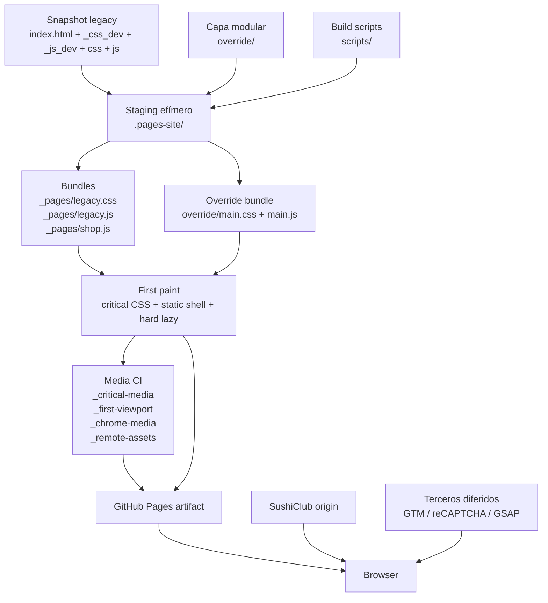
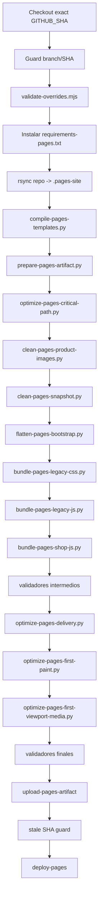
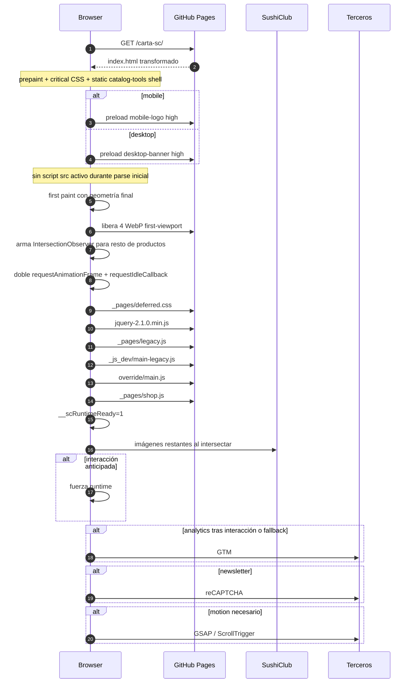

# Documentación técnica completa — carta-sc

> **Fuente única de verdad técnica del proyecto.** Este documento describe el estado efectivo de la rama `ux`: qué es source, qué es snapshot legacy, qué modifica `override/`, qué se transforma sólo durante build, qué termina publicado en GitHub Pages, cómo carga el navegador, qué optimizaciones existen y cómo reproducir/validar la entrega.
>
> Si una descripción histórica contradice el código o los validadores del SHA actual, prevalecen el código y los validadores. Toda modificación arquitectónica, de UI/UX, performance, build, assets o delivery debe actualizar este archivo.

---

## 0. Estado documentado

| Campo | Estado |
|---|---|
| Repositorio | `krestosa/carta-sc` |
| Rama | `ux` |
| Snapshot de origen | `https://www.sushiclub.com.ar/carta_delivery.php` |
| Deploy | `https://krestosa.github.io/carta-sc/` |
| Workflow canónico | `.github/workflows/deploy-pages-latest.yml` |
| Baseline documental inicial | `eb3674e4e344a4070883909b3f2d9de49cb37ea3` |
| Baseline mobile con logo como LCP | `8985504d668e61612a58209ebd781d7872382927` |
| Baseline first-viewport | `9111d8a5d3e0f0b80e03aba40243af10a68f031a` |
| Baseline funcional desktop estabilizado | `429cf6e58c62a79e91640bc46f5bb1fde471c073` |
| Política de assets | source code-only; binarios generados/mirror sólo en artifact |
| Dependencia de build adicional | `Pillow==12.3.0` vía `requirements-pages.txt` |

---

# 1. Qué es realmente este repositorio

No es la aplicación PHP original ni una SPA reimplementada. Es una arquitectura híbrida:

1. **Snapshot legacy:** `index.html`, `_css_dev/`, `_js_dev/`, `css/` y `js/`. Conservan DOM, contenido, selectores y compatibilidad de la carta original.
2. **Capa propia `override/`:** UI/UX, búsqueda, vistas, tema, cards, pricing, traits, modal, categorías, accesibilidad, normalización editorial, motion, carrito y correcciones de integración.
3. **Compilador de Pages:** scripts bajo `scripts/` transforman una copia efímera `.pages-site/`. No reescriben la snapshot fuente.
4. **Artifact publicado:** bundles, critical CSS inline, CSS deferred, templates compilados, media crítica same-origin, fuentes mirror y assets de first viewport generados en CI.

Regla central:

> **source Git != staging `.pages-site/` != artifact servido al navegador.**

---

# 2. Arquitectura



---

# 3. Árbol lógico

```text
.
├── .github/workflows/deploy-pages-latest.yml
├── .nojekyll
├── index.html
├── requirements-pages.txt
├── _css_dev/
├── _js_dev/
├── css/
├── js/
├── override/
├── scripts/
└── DOCUMENTACION_TECNICA_COMPLETA.md
```

Output generado y **no versionado como fuente**:

```text
.pages-site/
├── _pages/
│   ├── legacy.css
│   ├── legacy.js
│   ├── shop.js
│   └── deferred.css
├── _remote-assets/       # fuentes mirror
├── _critical-media/      # mobile-logo.png + desktop-banner.webp
├── _first-viewport/      # product-1.webp ... product-4.webp
├── _chrome-media/        # desktop-logo, flags, TikTok
├── override/main.css
├── override/main.js
└── index.html            # HTML transformado
```

---

# 4. Fuente legacy fuera de `override/`

## `index.html`

Es el input principal. Contiene la snapshot de la carta, contenido de productos, categorías, header, footer, newsletter, selectores de país, banners y referencias legacy. No es el HTML que finalmente recibe el navegador: la build modifica únicamente `.pages-site/index.html`.

Transformaciones principales sobre la copia:

- estampa SHA de versión;
- elimina runtime capturado/duplicado;
- limpia alturas/min-heights de snapshot como `.normCols`;
- repara IDs, fragments y labels;
- elimina estados/backgrounds de imgLiquid;
- elimina jQuery/GTM/reCAPTCHA duplicados capturados;
- inserta prepaint y static shell;
- compila templates;
- hard-lazy de productos;
- reescribe/mirroriza media crítica;
- retira scripts externos/locales del parse inicial;
- instala el delivery loader inline.

## `.nojekyll`

Fuerza entrega estática directa en Pages sin procesamiento Jekyll.

## `_css_dev/`

Fuente CSS legacy. En producción se concatena o se divide critical/deferred. Archivos relevantes:

- `bootstrap.min.css`: Bootstrap 3 legacy; gran parte queda sin usar, pero sigue como frontera de compatibilidad.
- `fnt-helvlig.css`: fuente/estilos HelvLig.
- `fontBar.css`: iconografía/barra legacy.
- `font-awesome.min.css`: Font Awesome; build normaliza el `@font-face` y usa `font-display: swap`.
- `slicknav__q_dd9216b6.css`: menú responsive legacy.
- `styles.css`: estilos globales originales.
- `styles_newver17.css`: header/layout de la revisión legacy.
- `jquery.fancybox.css`, `jquery.fancybox-buttons.css`: Fancybox.
- `nyroModal_wkTheme.css`: modal legacy.
- `slick.css`, `slick-theme.css`: Slick.
- `sweetalert2.min.css`: SweetAlert2.
- `daterangepicker.css`: se poda del bundle activo si no existe date flow.

## `css/`

- `styles_shop__q_a48cd660.css`: CSS principal de la carta/shop.
- `_aux__q_a48cd660.css`: reglas auxiliares del shop.

## `_js_dev/`

- `main.js`: bootstrap de desarrollo; en Pages su topología se aplana y no queda como request de arranque.
- `main-legacy.js`: host de comportamiento legacy separado.
- `modernizr-2.6.1-respond-1.1.0.min.js`: detección/compatibilidad.
- `jquery.easing.1.3.min.js`: easing legacy.
- `jquery.cycle2.min.js`: Cycle2.
- `jquery.slicknav.js`: navegación mobile.
- `jquery.nyroModal.custom.js`: modal legacy.
- `jquery.livequery.min.js`: livequery.
- `jquery.fancybox.js`, `jquery.fancybox-buttons.js`, `jquery.fancybox-media.js`: Fancybox.
- `moment.min.js`, `daterangepicker.js`: fecha; pueden podarse del runtime activo si no hay flujo consumidor.
- `imgLiquid.js`: librería histórica de imágenes; su trabajo de catálogo se elimina del artifact porque la geometría ya es estática.
- `slick.min.js`: carruseles.
- `sweetalert2.min.js`: alertas.
- `plugins.js`: helpers legacy.
- `mapKrc.js`: mapas; queda inactivo/eliminable si no existe map flow.

## `js/`

- `jquery-2.1.0.min.js`: dependencia base legacy; se conserva pero sale del parse inicial.
- `bootstrap.min.js`: Bootstrap JS legacy.
- `funcionesShop__q_f352afe3.js`: helpers/acciones shop.
- `main_shop__q_a48cd660.js`: startup y comportamiento shop; build reparte jobs y elimina normalizaciones redundantes.
- `main_shop_maps__q_9fc895e1.js`: integración de mapas; se retira del delivery activo si no existe consumidor.

---

# 5. Política code-only y assets

No se versionan binarios de producción bajo árboles como `gfx/`, `iconos/`, `uploads/`, `uploads_shop/`, `fonts/` o `fuentes/`. La build resuelve los recursos de tres formas:

1. **remotos:** se apuntan al host de SushiClub;
2. **mirror de fuentes:** `_remote-assets/fonts/` y `_remote-assets/fuentes/`;
3. **media optimizada de CI:** `_critical-media/`, `_first-viewport/`, `_chrome-media/`.

Esto mantiene el repo liviano y separa código de recursos capturados.

La build es reproducible en lógica/topología, pero no 100 % hermética byte-a-byte: descarga ciertos inputs del host de SushiClub. Si esos bytes upstream cambian, el mismo SHA podría producir medios distintos. Para hermeticidad total habría que fijar hashes/bytes de los inputs externos.

---

# 6. `override/`: contrato y ownership

`override/` contiene el producto propio. Principios:

- módulos pequeños con ownership claro;
- boot guards para evitar doble inicialización;
- teardown de listeners/observers/timers cuando corresponde;
- templates como fuente de markup fijo;
- CSS dividido por responsabilidad;
- DOM legacy tratado como frontera de compatibilidad;
- no depender de la topología del loader de desarrollo;
- mantener accesibilidad y `prefers-reduced-motion`.

## Entrypoints

### `override/main.js`

Manifest/loader de desarrollo. En producción sus módulos se concatenan en orden en el mismo path `override/main.js`. No debe depender de `document.currentScript`.

### `override/main.css`

Manifest de CSS. En producción los imports se resuelven y concatenan; luego first-paint separa critical de deferred.

### `override/templates/registry.js`

Registro compilado en producción. Los HTML editables son la fuente; el browser no hace fetch de templates en Pages.

---

# 7. Inventario de módulos `override/`

## `override/core/`

| Archivo | Responsabilidad |
|---|---|
| `variables.js` | estado/constantes JS comunes |
| `variables.css` | design tokens, tamaños y variables compartidas |
| `utils.js` | helpers DOM/runtime |
| `render-lifecycle.js` | coordinación de prepaint/layout-ready/hydration |
| `theme.css` | tokens y resolución visual de tema |
| `a11y.css` | utilidades accesibles; hit areas; correcciones de controles legacy |
| `prepaint.css` | geometría determinista del primer paint; reserva catálogo/header/banner |
| `performance.css` | reglas de performance/containment |
| `no-loading-state.css` | evita estados visuales de carga que interfieran con snapshot estable |

`prepaint.css` es crítico: la geometría inicial debe coincidir con la final. Actualmente mantiene el banner en ratio natural `1500:157` antes **y después** de hydration; no se permite volver a una altura fija `157px`.

## `override/mutations/`

- `dom-normalization.js`: normaliza DOM legacy para el runtime propio.
- `legacy-category-hover.js`: neutraliza/compatibiliza hover legacy de categorías.
- `history.js`: integración con historial/estado de navegación.

## `override/motion/`

- `main.js`: carga lazy del stack motion; GSAP/ScrollTrigger no entran al critical path ni por scroll sintético.
- `main.css`: estilos base de motion.
- `global-ui.js`: motion global de UI.

## `override/features/catalog/`

- `catalog.css`: reglas generales del catálogo.
- `layout.css`: layout/responsividad del catálogo.

## `override/features/image-preloader/`

- `image-preloader.js`: asigna loading/fetch priority, observa imágenes y stages.
- `image-preloader.css`: placeholders/estados de imagen con geometría estable.

En Pages el delivery loader controla el primer viewport antes de que este módulo arranque.

## `override/features/content-normalizer/`

- `content-normalizer.js`: coordinador.
- `rules.js`: casing editorial, conectores y marcas protegidas.
- `dom.js`: aplicación al DOM.
- `observer.js`: MutationObserver acotado a hosts afectados.
- `content-normalizer.css`: limpieza visual de estilos heredados.

Normaliza títulos/descripciones sin reescribir manualmente la snapshot. Protege marcas como `SushiClub`/`AQA`, limpia puntos no decimales y estilos bold heredados.

---

# 8. Componentes UI

## Section heading — `override/components/section-heading/`

- `section-heading.js`: conexión/comportamiento.
- `layout.css`: geometría.
- `section-heading.css`: estilo.
- `responsive.css`: breakpoints.

## Mobile header — `override/components/mobile-header/`

- `mobile-header.js`: repara SlickNav y estado header sin mutar tarde la posición del logo LCP.
- `mobile-header.css`: geometría final del header mobile; logo visible/estable desde primer paint.
- `morph.css`: estado visual menu/close y tratamiento por tema.

## Catalog tools — `override/components/catalog-tools/`

- `catalog-tools.html`: template toolbar/búsqueda/vistas/tema.
- `catalog-tools.js`: montaje y coordinación.
- `catalog-tools.css`: layout/controles.
- `view.js`: modos `compact`, `normal`, `list`; default `compact`.
- `view-stability.css`: geometría estable al cambiar/hidratar vista.
- `theme.js`: selector de tema.
- `theme.css`: UI del selector.
- `search.js`: búsqueda/filtrado.
- `search-state.css`: estados de resultados.

Regla UX vigente: alta densidad/`compact` es la vista inicial salvo preferencia persistida; luego `normal`; luego `list`.

## Category nav — `override/components/category-nav/`

- `category-nav.html`: template de navegación.
- `category-nav.js`: coordinador.
- `core.js`: estado base.
- `layout.js`: montaje/layout.
- `active-state.js`: categoría activa.
- `indicator.js`: indicador activo.
- `motion.js` + `motion.css`: momentum/animación del indicador.
- `scroll-spy.js`: sección activa según scroll con geometría cacheada.
- `sticky-state.js`: sticky state.
- `rail.js`: estado/overflow/sticky del rail.
- `rail-position.js`: posicionamiento.
- `rail-controls.js`: flechas/controles.
- `desktop.css`, `mobile.css`, `controls.css`, `compatibility.css`: estilos por ownership.

Las lecturas geométricas costosas se separan de writes/frame de montaje y se cachean. No reintroducir `getBoundingClientRect()` en cada scroll.

## Product card — `override/components/product-card/`

- `product-card.html`: template.
- `product-card.js`: coordinador.
- `data.js`: extracción/modelado desde DOM legacy.
- `content.js`: contenido.
- `a11y.js`: nombres/semántica.
- `motion.js`: interacción de card.
- `reveal-motion.js`: reveal sólo below-the-fold; las cards iniciales nunca deben ocultarse/reaparecer porque eso retrasa LCP.
- `layout.css`, `content.css`, `pricing.css`, `image-ratio.css`, `motion.css`: layout, contenido, precios, ratio y motion.

Pricing vigente: descuento y luego precio tachado; traits picante/vegano junto al precio tachado en compact/list/modal según el contrato de UI.

## Product modal — `override/components/product-modal/`

- `product-modal.html`: template.
- `product-modal.js`: montaje/coordinación.
- `view.js`: proyección de datos al modal.
- `a11y.js`: foco/semántica.
- `motion.js`: apertura/cierre.
- `shell.css`, `content.css`, `controls.css`, `responsive.css`, `theme.css`, `motion.css`: capas visuales.

Mantiene compatibilidad con el flujo/cart/backend real; no reemplaza el backend PHP.

## Cart — `override/components/cart/`

- `cart.js`: integración de estado/DOM.
- `cart.css`: layout/estilos.
- `badge-motion.js`, `list-motion.js`, `scroll-motion.js`: animaciones específicas.

---

# 9. UI/UX efectiva

- vista inicial de catálogo: `compact`/alta densidad;
- orden de selector: compact → normal → list;
- preferencias de vista y tema se restauran antes de hydration para evitar flash/layout shift;
- búsqueda y filtros actúan sobre la snapshot sin duplicar catálogo;
- rail de categorías horizontal, sticky y con indicador activo animado;
- cards iniciales visibles desde first paint; reveal se reserva para contenido below-the-fold;
- modal accesible y responsive;
- tema system/light/dark;
- contenido editorial normalizado con reglas en español;
- motion cargado bajo interacción, no como requisito para render inicial;
- mobile header estable, sin duplicados SlickNav en flow;
- desktop header conserva sus controles legacy, pero build les añade semántica/dimensiones sin alterar el backend.

---

# 10. Pipeline de build exacto



El workflow usa `concurrency` con cancelación y dos guards de SHA para impedir que un run viejo pise un commit más nuevo.

---

# 11. Scripts de build, archivo por archivo

| Script | Función |
|---|---|
| `compile-pages-templates.py` | compila los templates permitidos dentro del registry de producción |
| `prepare-pages-artifact.py` | prepara staging, estampa versión y manifiestos |
| `optimize-pages-critical-path.py` | hints/preloads/font-display y preparación del critical path |
| `clean-pages-product-images.py` | elimina estados/backgrounds imgLiquid capturados |
| `clean-pages-snapshot.py` | limpia runtime capturado, alturas, IDs, a11y, GTM/reCAPTCHA/jQuery duplicados |
| `flatten-pages-bootstrap.py` | aplana el bootstrap de desarrollo y aplica prepaint temprano |
| `bundle-pages-legacy-css.py` | concatena 16 CSS legacy, rebasa URLs y normaliza font faces |
| `bundle-pages-legacy-js.py` | concatena 16 JS legacy preservando orden/source markers |
| `bundle-pages-shop-js.py` | concatena los 2 JS shop y poda date flow inactivo |
| `externalize-pages-static-assets.py` | enforce code-only, reescribe recursos y mirroriza fuentes |
| `optimize-pages-delivery.py` | retira CSS/JS del parse, hard-lazy, difiere GTM/reCAPTCHA, crea loader base |
| `optimize-pages-first-paint.py` | split critical/deferred; 141 productos hard-lazy; static tools shell; logo mobile LCP; poda imgLiquid/Knormalize |
| `optimize-pages-first-viewport-media.py` | genera 4 WebP de primera fila; localiza banner LCP desktop; genera logo/flags/TikTok WebP; añade dimensiones; normaliza country links y valida budgets |
| `validate-pages-local-assets.py` | asegura que referencias locales resuelvan dentro del artifact |
| `validate-pages-html.py` | IDs, fragments, forms, social links, invariantes HTML/UX |
| `validate-pages-performance-budget.py` | guard de topología/presupuesto previo a first-paint final |
| `validate-overrides.mjs` | manifiestos, sintaxis, archivos huérfanos e invariantes de `override/` |

`requirements-pages.txt` fija `Pillow==12.3.0`. Es dependencia **de compilación**, no se entrega ni ejecuta en el navegador.

---

# 12. Qué se elimina y qué se difiere

| Elemento | Tratamiento |
|---|---|
| binarios capturados | no se versionan; remoto o generado en CI |
| jQuery 2.1.0 | se conserva por compatibilidad, pero no bloquea el parse |
| Bootstrap JS/CSS legacy | se conserva donde aún puede ser dependencia; sale del critical path cuando es seguro |
| GTM capturado | se elimina; bootstrap canónico se difiere a interacción/timeout |
| reCAPTCHA capturado | se elimina; API canónica se carga por interacción/proximidad al newsletter |
| Google Maps | se elimina del delivery activo si no existe consumidor |
| Moment/DateRangePicker | poda condicional cuando no existe date flow |
| `shop_imgLiquids` | eliminado del bundle final; redundante |
| `shop_normalizeCols` | eliminado del bundle final; redundante y riesgoso para CLS |
| `Knormalize` | eliminado del bundle final |
| source maps stale | removidos del artifact |
| templates `.html` | compilados; no fetch runtime |
| imports CSS override | concatenados; luego split critical/deferred |
| GSAP/ScrollTrigger | lazy bajo interacción; no parse inicial ni scroll sintético |
| reveal de cards iniciales | eliminado; las cards above-the-fold nunca se ocultan |

---

# 13. Estrategia de media y red

## Tier 1 — LCP real

### Mobile

`_critical-media/mobile-logo.png`

- same-origin;
- `loading=eager`;
- `fetchpriority=high`;
- `333×100`;
- no mutación tardía de posición/opacity/transform.

### Desktop

`_critical-media/desktop-banner.webp`

- source natural validado `1500×157`;
- same-origin;
- preload `high` sólo con `media="(min-width: 993px)"`;
- `` mantiene `eager/async` y dimensiones intrínsecas;
- CSS persistente usa `width:100%; height:auto; aspect-ratio:1500/157`.

## Tier 2 — primera fila visual

CI toma los primeros cuatro productos y genera:

```text
_first-viewport/product-1.webp
_first-viewport/product-2.webp
_first-viewport/product-3.webp
_first-viewport/product-4.webp
```

Presupuesto por archivo: máximo 36 KiB. En el baseline `9111d8a5...` quedaron aproximadamente entre 8 y 12 KiB. No compiten con el LCP desde el parser: el loader los libera inmediatamente después de que el media gate inicial esté listo.

## Tier 3 — resto del catálogo

Las otras imágenes de producto conservan la URL en `data-sc-src` y sólo se materializan mediante `IntersectionObserver`.

## Chrome desktop generado en CI

```text
_chrome-media/desktop-logo.webp
_chrome-media/flag-arg.webp
_chrome-media/flag-mex.webp
_chrome-media/flag-par.webp
_chrome-media/flag-esp.webp
_chrome-media/flag-uru.webp
_chrome-media/flag-usa.webp
_chrome-media/tiktok.webp
```

La build deriva dimensiones reales con Pillow y añade `width/height`. Las banderas quedan con `alt=""` porque el enlace recibe `aria-label` de país; esto evita nombres redundantes y mantiene nombre accesible en links image-only.

Marcas que siguen remotas (Chandon, Galicia Eminent, SmartWater, Aquarius) reciben dimensiones intrínsecas reales durante build para impedir shifts.

---

# 14. Orden real de carga del navegador



---

# 15. Performance: causas históricas y fixes

## CLS

Problemas corregidos:

- `.normCols` capturada con `height/min-height` gigantes;
- prepaint `normal` mientras runtime cambiaba a `compact` (relayout 1→2 columnas mobile);
- banner con atributo `height=157` interpretado como altura visual fija luego de hydration;
- logo/banderas/marcas sin dimensiones desktop;
- static tools/trait row sin reserva;
- SlickNav provisional entrando al flow.

Contrato actual: la primera geometría debe coincidir con la final; no “arreglar” layout recién en runtime.

## LCP

Causas corregidas:

- cards iniciales ocultadas con GSAP y reveladas tarde;
- logo mobile mutado tardíamente (`margin-left`/transform/opacity);
- preloads de productos pesados compitiendo con el LCP real;
- banner desktop remoto y con ratio/presentational height inestable.

## TBT / main thread

- runtime detrás del first paint;
- startup shop fraccionado;
- category rail con geometría cacheada;
- scroll path sin `getBoundingClientRect()` continuo;
- normalizador editorial troceado por presupuesto y MutationObserver localizado;
- GSAP fuera del arranque.

## Speed Index

La primera versión hard-lazy protegió LCP pero dejó el viewport visual incompleto. El tier `_first-viewport/` resuelve ese trade-off: media pequeña después del LCP, resto por intersección.

---

# 16. Accesibilidad

- controles propios con labels/roles/estados ARIA;
- modal con manejo de foco;
- touch targets corregidos sin escalar artwork;
- `prefers-reduced-motion` respetado;
- imágenes decorativas con alt vacío cuando el contexto/link ya aporta nombre;
- country links desktop reciben `aria-label` (`Argentina`, `México`, `Paraguay`, `España`, `Uruguay`, `Estados Unidos`);
- hit area desktop de los enlaces de banderas mínimo 24×24 CSS px;
- TikTok mantiene ratio visual cuadrado aunque el artwork se muestre a 15 px.

---

# 17. Estado y persistencia

La UI evita guardar estado crítico sólo en DOM temporal. Preferencias de tema/vista se leen lo suficientemente temprano para afectar prepaint. Compatibilidad legacy sigue usando globals/DOM donde el host lo exige; esa frontera no debe ampliarse sin necesidad.

Al modificar persistencia:

- mantener migración de valores legacy;
- no introducir cambios de layout después de first paint;
- validar mobile y desktop por separado.

---

# 18. Validación y guards

La build aborta si:

- falta un template esperado o aparece uno no registrado;
- un import CSS/JS no resuelve;
- existe archivo override huérfano;
- queda un script externo bloqueante;
- faltan assets locales activos;
- se rompe un ID/fragment/form esperado;
- no se encuentran las 141 imágenes de producto;
- no hay 4 first-viewport WebP o exceden 36 KiB;
- cambia upstream el banner de `1500×157`;
- falta el logo desktop o dimensiones válidas;
- faltan country links accesibles;
- un run de Pages deja de corresponder con el head actual de `ux`.

El build debe fallar frente a una snapshot inesperada; no relajar regex/guards sin entender primero qué cambió.

---

# 19. Build reproducible

Reproducción lógica del workflow:

```bash
rm -rf .pages-site
mkdir -p .pages-site
rsync -a --exclude=.git --exclude=.pages-site ./ .pages-site/
python3 -m pip install -r requirements-pages.txt
python3 scripts/compile-pages-templates.py
python3 scripts/prepare-pages-artifact.py
python3 scripts/optimize-pages-critical-path.py
python3 scripts/clean-pages-product-images.py
python3 scripts/clean-pages-snapshot.py
python3 scripts/flatten-pages-bootstrap.py
python3 scripts/bundle-pages-legacy-css.py
python3 scripts/bundle-pages-legacy-js.py
python3 scripts/bundle-pages-shop-js.py
python3 scripts/validate-pages-local-assets.py
python3 scripts/validate-pages-html.py
python3 scripts/validate-pages-performance-budget.py
python3 scripts/optimize-pages-delivery.py
python3 scripts/optimize-pages-first-paint.py
python3 scripts/optimize-pages-first-viewport-media.py
python3 scripts/validate-pages-local-assets.py
python3 scripts/validate-pages-html.py
```

Se debe ejecutar con `GITHUB_SHA` igual al commit exacto de la build. El workflow además hace `node --check` de los bundles finales y guards específicos de first paint.

### Reproducible vs hermético

- **reproducible en código:** sí, con SHA + Pillow pinneado + mismos inputs upstream;
- **hermético/offline byte-a-byte:** no todavía, porque fonts/media se descargan del host original;
- para hermeticidad total habría que fijar hashes y un store inmutable de esos inputs.

---

# 20. Contrato de mantenimiento

## Cambio de UI fija

- editar template owner;
- editar CSS owner;
- usar JS para comportamiento, no para recrear markup fijo innecesariamente;
- actualizar manifiestos/validadores si corresponde.

## Nuevo módulo JS

- archivo bajo owner correcto;
- boot guard;
- teardown si registra recursos persistentes;
- entrada explícita en `override/main.js`;
- no depender de loader de desarrollo.

## Nuevo CSS

- owner claro;
- import en manifest;
- decidir si es critical o deferred;
- verificar first paint sin runtime.

## Cambio de snapshot

Ejecutar pipeline completo. Los scripts usan invariantes intencionalmente estrictas.

## Cambio de asset

No agregar binario al source por conveniencia. Elegir conscientemente remoto, mirror de build o media crítica CI.

---

# 21. Troubleshooting

### CLS alto

Revisar, en orden:

1. `data-sc-catalog-view` inicial vs runtime;
2. `.normCols` con alturas capturadas;
3. banner `height:auto` + ratio `1500/157`;
4. imágenes sin `width/height`;
5. static tools shell/trait placeholder;
6. fuentes tardías;
7. writes de layout posteriores al paint.

### LCP con red rápida pero render delay alto

Buscar opacity/visibility, transforms, reveals, prepaint, ancestor display y mutaciones post-runtime del candidato.

### Forced reflow

Buscar combinación de writes con `offset*`, `scroll*`, `getBoundingClientRect` o computed style en el mismo frame. Medir en invalidación/resize y cachear para scroll.

### 404 de assets

Ejecutar `validate-pages-local-assets.py`; revisar externalización y mirrors.

### Build falla por regex

No borrar el guard. Comparar snapshot/artifact y ajustar la transformación sólo si el contrato real cambió.

---

# 22. Decisiones que NO deben repetirse

- diferir módulos estructurales sin reservar geometría: produjo CLS > 1;
- esconder las cards iniciales para hacer reveal: retrasó LCP;
- prepaint `normal` y runtime `compact`: produjo relayout masivo;
- precargar PNG de productos pesados cuando el LCP real era el logo: competencia de red innecesaria;
- cargar GSAP/ScrollTrigger por `scroll` sintético: contaminaba el critical path;
- leer geometría del rail en cada scroll/frame;
- tratar `height=157` del banner como altura visual fija en anchos responsive;
- modificar build scripts sin reconstruir/inspeccionar el artifact exacto.

---

# 23. Evolución de performance relevante

| SHA | Cambio |
|---|---|
| `07fb0ca...` | delivery optimization inicial: CSS local inline, scripts/terceros diferidos |
| `70c60d8...` | runtime detrás del first paint, hard-lazy general |
| `209f93e...` | prepaint compact consistente y limpieza `.normCols` |
| `f40df0a...` | geometría del category rail cacheada |
| `1488c3e...` | cards iniciales dejan de ocultarse/revelarse |
| `eb3674e...` | motion deja de cargarse por scroll sintético |
| `0856b84...` | ratio de banner/TikTok y Font Awesome swap |
| `8985504...` | logo mobile se consolida como único LCP prioritario; 141 productos hard-lazy |
| `9111d8a...` | cuatro WebP de first viewport generados en CI; Pillow fijado |
| `429cf6e...` | estabilización desktop: banner same-origin/ratio persistente; logo/flags/TikTok dimensionados y accesibles |

---

# 24. Checklist antes de considerar un cambio terminado

```text
[ ] scope identificado
[ ] no se modificó legacy innecesariamente
[ ] manifests JS/CSS/templates siguen exactos
[ ] boot guards y teardown correctos
[ ] node --check pasa
[ ] validate-overrides pasa
[ ] build completo de .pages-site pasa
[ ] local-assets pasa
[ ] HTML validation pasa
[ ] performance budget pasa
[ ] first-paint/media guards pasan
[ ] artifact inspeccionado, no sólo source
[ ] workflow desplegó exactamente el head actual
[ ] si afecta performance, PageSpeed mide ESE SHA y breakpoint correcto
[ ] documentación maestra actualizada
```

---

# 25. Ownership final

- snapshot/contenido legacy → `index.html`, `_css_dev/`, `_js_dev/`, `css/`, `js/`;
- nueva UX/comportamiento → `override/`;
- markup fijo nuevo → templates owner;
- first paint/estado visual temprano → `prepaint.css` + build first-paint;
- optimización exclusiva de Pages → `scripts/` sobre `.pages-site/`;
- publicación/concurrencia/guards → workflow;
- motion tardío → `override/motion/` y módulos motion owner;
- media binaria crítica → generada en CI, no source;
- backend PHP y recursos no vendorizados → host SushiClub.

---

# 26. Glosario

| Término | Significado |
|---|---|
| snapshot | captura estática usada como input |
| legacy | código original preservado como frontera de compatibilidad |
| override | capa propia modular |
| prepaint | geometría/estado aplicado antes de hydration |
| hydration | conexión del runtime propio al DOM ya existente; no React |
| static shell | markup insertado en build para reservar UI antes del JS |
| critical CSS | CSS inline necesario para primer viewport estable |
| deferred CSS | estilos cargables con runtime sin romper primer paint |
| hard-lazy | imagen sin `src` inicial; URL en `data-sc-src` |
| first viewport | tier de cuatro WebP pequeños liberados después del LCP |
| chrome media | assets pequeños del header/selector de país generados en CI |
| LCP mirror | copia same-origin del logo mobile o banner desktop |
| code-only | política de no versionar binarios de producción |
| staging | `.pages-site/` |
| artifact | árbol final publicado |
| hermético | build sin inputs externos mutables |
| boot guard | flag que impide inicialización múltiple |

---

## Fin del documento maestro

Si una futura modificación hace que este archivo deje de describir el artifact real, **la tarea técnica no está completa hasta actualizarlo**.
